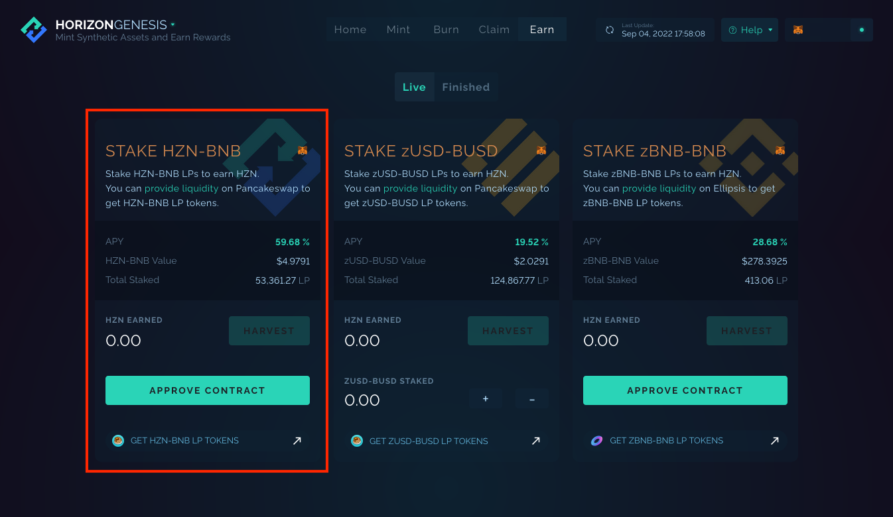
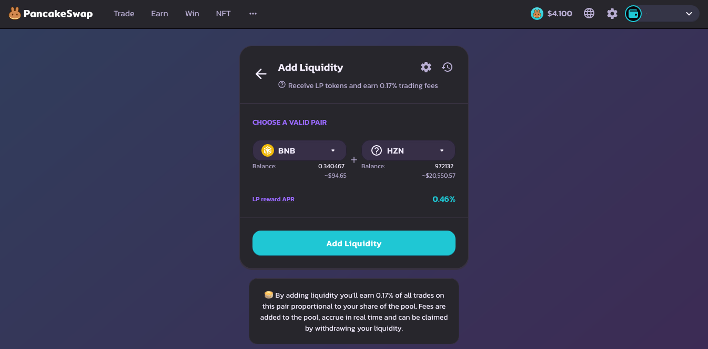
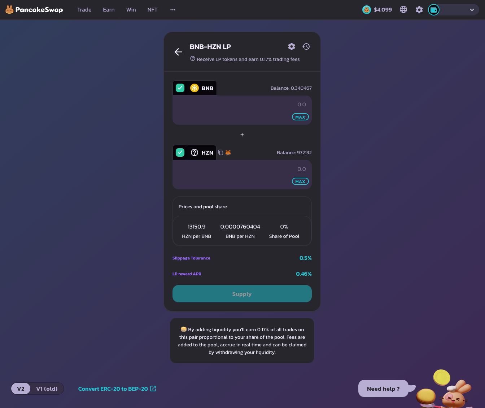
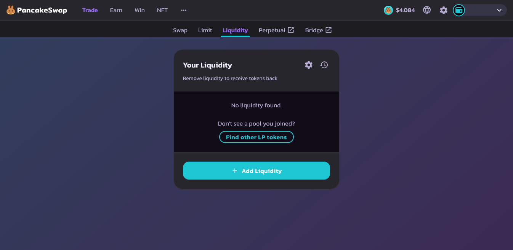

# Add Liquidity for HZN-BNB

Adding liquidity to HZN-BNB supports the HZN-BNB liquidity on PancakeSwap, allowing users to trade between HZN and BNB on a DEX (decentralized exchange).

The following is a guide on how to add liquidity in the HZN-BNB pool in the Earn tab to earn yield.


Note that there is a risk of impermanent loss for the HZN-BNB pool.


### Step 0. Prerequisite

1. Make sure that you have a BNB Chain compatible wallet. This will most likely be in the form of MetaMask or Binance Wallet. Refer to [#1.-set-up-wallet](getting-started.md#1.-set-up-wallet "mention") for more information.
2. You will need to have a bit of BNB in the wallet for the transactions. Expect around 0.001-0.002 BNB per transaction.

### Step 1. Approve Contract

<figure><figcaption></figcaption></figure>

1. Go to [https://genesis.horizonprotocol.com/earn](https://genesis.horizonprotocol.com/earn).
2. "Approve Contract" for "STAKE HZN-BNB". This action will cost a bit of BNB.
3. Click on Get HZN-BNB LP Tokens.

### Step 2. Get zUSD-BUSD LP Tokens

LP stands for "Liquidity Provider", which is a token that typically represents the amount of liquidity that has been put into the pool.

1. Click on the link at the bottom of the Earn box that says "GET HZN-BNB LP TOKENS". ([https://pancakeswap.finance/add/BNB/0xc0eff7749b125444953ef89682201fb8c6a917cd](https://pancakeswap.finance/add/BNB/0xc0eff7749b125444953ef89682201fb8c6a917cd))
2. Once in PancakeSwap, if you haven't connected your wallet to PancakeSwap yet, you will need to do that.)
3. If you already have HZN and BNB in your wallet, you can now deposit them to add liquidity by clicking "Add Liquidity". The box will expand and show you more options.
4. After depositing your HZN and BNB, you will now have HZN-BNB LP Tokens. These LP tokens will increase in value as it shares the dividends of the trade fees when trading between HZN and BNB.

<figure><figcaption>
Add Liquidity Page.
</figcaption></figure>

<figure><figcaption>
Add Liquidity Page Expanded upon clicking "Add Liquidity" button.
</figcaption></figure>

### Step 3. Deposit LP Token in the Earn Tab

The last and final step for depositing the LP tokens into the Earn tab to earn HZN.

<figure><figcaption>
Depositing into the Earn tab.
</figcaption></figure>

1. In Genesis's Earn tab ([https://genesis.horizonprotocol.com/earn](https://genesis.horizonprotocol.com/earn)), assuming that the contract has already been approved, there should be a \
   "+" and "-" icon. Click the "+" icon and input how much HZN-BNB LP tokens you want to deposit. The amount of LP tokens available should be visible in the bottom right hand side of the input box.\
   \
   NOTE: there will be a 7 day lock, which means you will not be able to take the LP tokens out within 7 days.
2. Once you confirm the transaction in your wallet, you have completed all the steps to adding liquidity for the HZN-BNB pool!

### Extra: Remove LP Tokens

Removing consists of performing the steps 2 and 3 in reverse order.

1. In Genesis's Earn tab ([https://genesis.horizonprotocol.com/earn](https://genesis.horizonprotocol.com/earn)), remove the LP tokens from the Earn tab by pressing the "-" button, filling in the input with the number of tokens to remove, then clicking "UNSTAKE".
2. Click on the link at the bottom of the Earn box that says "GET HZN-BNB LP TOKENS"([https://pancakeswap.finance/add/BNB/0xc0eff7749b125444953ef89682201fb8c6a917cd](https://pancakeswap.finance/add/BNB/0xc0eff7749b125444953ef89682201fb8c6a917cd)) and click the back button next to "Add Liquidity". This will take you to the "Your Liquidity" page. Your LP tokens should be visible here if they have been unstaked. You can then remove liquidity to get HZN and BNB back.

<figure><figcaption>
"Your Liquidity" page.
</figcaption></figure>
