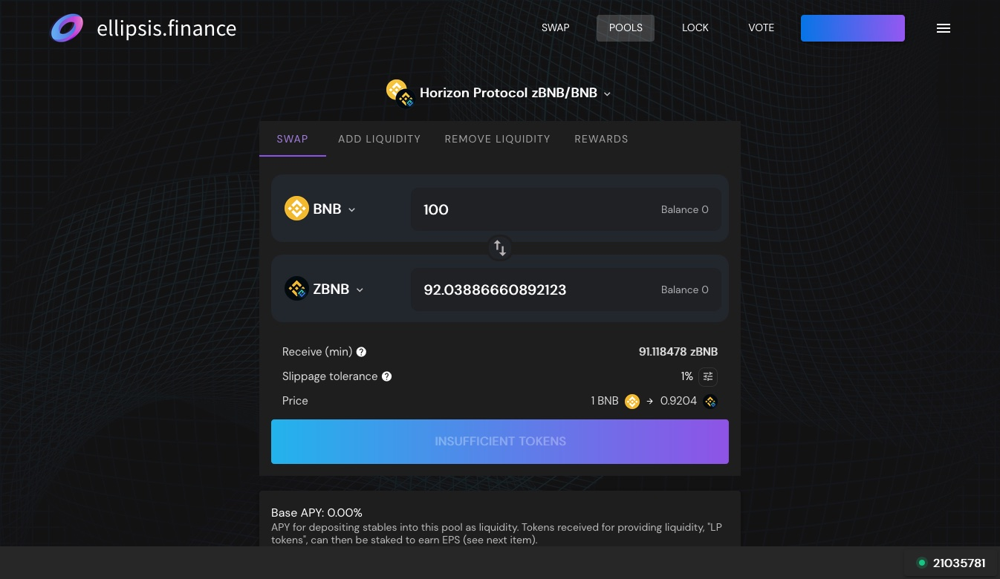

# Add Liquidity for zBNB-BNB

Adding liquidity to zBNB-BNB supports the zBNB-BNB liquidity on Ellipsis Finance, allowing users to trade between zBNB and BNB on a DEX (decentralized exchange).

The zBNB-BNB Liquidity Pool is one of the safest ways to earn yield as there is no impermanent loss as both sides of the pool consist of a stablecoin that should not fluctuate in value.

The following is a guide on how to add liquidity in the zBNB-BNB pool in the Earn tab to earn yield.

### Step 0. Prerequisite

1. Make sure that you have a BNB Chain compatible wallet. This will most likely be in the form of MetaMask or Binance Wallet. Refer to [#1.-set-up-wallet](getting-started.md#1.-set-up-wallet "mention") for more information.
2. You will need to have a bit of BNB in the wallet for the transactions. Expect around 0.001-0.002 BNB per transaction.

### Step 1. Approve Contract

<figure><figcaption></figcaption></figure>

1. Go to [https://genesis.horizonprotocol.com/earn](https://genesis.horizonprotocol.com/earn).
2. "Approve Contract" for "STAKE zBNB-BNB". This action will cost a bit of BNB.
3. Click on Get zBNB-BNB LP Tokens.

### Step 2. Get zBNB-BNB LP Tokens

LP stands for "Liquidity Provider", which is a token that typically represents the amount of liquidity that has been put into the pool.

1. Click on the link at the bottom of the Earn box that says "GET zBNB-BNB LP TOKENS". ([https://ellipsis.finance/pool/0x51d5B7A71F807C950A45dD8b1400E83826Fc49F3](https://ellipsis.finance/pool/0x51d5B7A71F807C950A45dD8b1400E83826Fc49F3))
2. Once in Ellipsis Finance, if you haven't connected your wallet to Ellipsis Finance yet, you will need to do that.)
3. If you already have zBNB and BNB in your wallet, you can now deposit them to add liquidity by clicking "Add Liquidity".&#x20;
4. After depositing your zBNB and BNB, you will now have zBNB-BNB LP Tokens. These LP tokens will increase in value as it shares the dividends of the trade fees when trading between zBNB and BNB.

<figure><figcaption>
The first page you will arrive on is the Swap page after clicking "GET zBNB-BNB LP TOKENS".
</figcaption></figure>

<figure><figcaption>
A full page view of the Swap page on Ellipsis Finance.
</figcaption></figure>

<figure><figcaption>
Click "Add Liquidity" to get to the Add Liquidity page.
</figcaption></figure>

### Step 3. Deposit LP Token in the Earn Tab

The last and final step for depositing the LP tokens into the Earn tab to earn HZN.

<figure><figcaption>
Depositing into the Earn tab.
</figcaption></figure>

1. In Genesis's Earn tab ([https://genesis.horizonprotocol.com/earn](https://genesis.horizonprotocol.com/earn)), assuming that the contract has already been approved, there should be a \
   "+" and "-" icons. Click the "+" icon and input how many zBNB-BNB LP tokens you want to deposit. The amount of LP tokens available should be visible on the bottom right-hand side of the input box.\
   \
   NOTE: there will be a 7-day lock, which means you will not be able to take the LP tokens out within 7 days.
2. Once you confirm the transaction in your wallet, you have completed all the steps to adding liquidity to the zBNB-BNB pool!

### Extra: Remove LP Tokens

Removing consists of performing steps 2 and 3 in reverse order.

1. In Genesis's Earn tab ([https://genesis.horizonprotocol.com/earn](https://genesis.horizonprotocol.com/earn)), remove the LP tokens from the Earn tab by pressing the "-" button, filling in the input with the number of tokens to remove, then clicking "UNSTAKE".
2. Click on the link at the bottom of the Earn box that says "GET zBNB-BNB LP TOKENS"([https://ellipsis.finance/pool/0x51d5B7A71F807C950A45dD8b1400E83826Fc49F3](https://ellipsis.finance/pool/0x51d5B7A71F807C950A45dD8b1400E83826Fc49F3)) and click the back button next to "Add Liquidity". This will take you to the "Your Liquidity" page. Your LP tokens should be visible here if they have been unstaked. You can then remove liquidity to get zBNB and BNB back.
