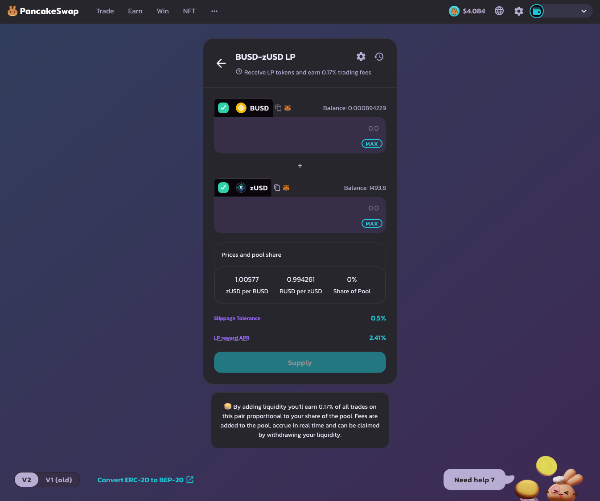
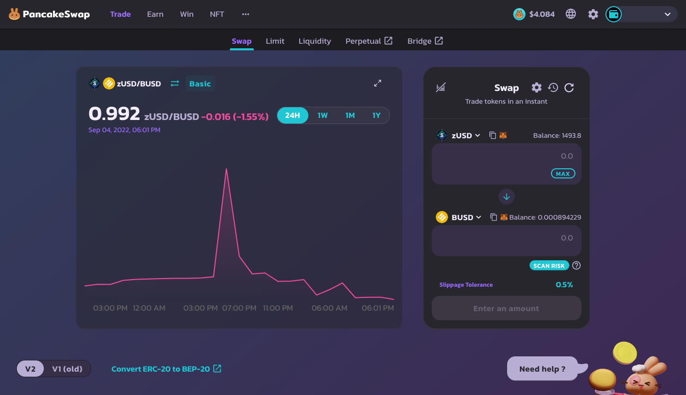

# Add Liquidity for zUSD-BUSD

Adding liquidity to zUSD-BUSD supports the zUSD-BUSD liquidity on PancakeSwap, allowing users to trade between zUSD and BUSD on a DEX (decentralized exchange).

The zUSD-BUSD Liquidity Pool is one of the safest ways to earn yield as there is no impermanent loss as both sides of the pool consist of a stablecoin that should not fluctuate in value. The following is a guide on how to add liquidity in the zUSD-BUSD pool in the Earn tab to earn yield.

### Step 0. Prerequisite

1. Make sure that you have a BNB Chain compatible wallet. This will most likely be in the form of MetaMask or Binance Wallet. Refer to [#1.-set-up-wallet](getting-started.md#1.-set-up-wallet "mention") for more information.
2. You will need to have a bit of BNB in the wallet for the transactions. Expect around 0.001-0.002 BNB per transaction.

### Step 1. Approve Contract

<figure><figcaption></figcaption></figure>

1. Go to [https://genesis.horizonprotocol.com/earn](https://genesis.horizonprotocol.com/earn).
2. "Approve Contract" for "STAKE zUSD-BUSD". This action will cost a bit of BNB.
3. Click on Get ZUSD-BUSD LP Tokens.

### Step 2. Get zUSD-BUSD LP Tokens

LP stands for "Liquidity Provider", which is a token that typically represents the amount of liquidity that has been put into the pool.

1. Click on the link at the bottom of the Earn box that says "GET ZUSD-BUSD LP TOKENS". ([https://pancakeswap.finance/add/0xe9e7CEA3DedcA5984780Bafc599bD69ADd087D56/0xF0186490B18CB74619816CfC7FeB51cdbe4ae7b9](https://pancakeswap.finance/add/0xe9e7CEA3DedcA5984780Bafc599bD69ADd087D56/0xF0186490B18CB74619816CfC7FeB51cdbe4ae7b9))
2. Once in PancakeSwap, if you haven't connected your wallet to PancakeSwap yet, you will need to do that.)
3. If you already have zUSD and BUSD in your wallet, you can now deposit them to add liquidity by clicking "Add Liquidity". The box will expand and show you more options.
4. After depositing your zUSD and BUSD, you will now have zUSD-BUSD LP Tokens. These LP tokens will increase in value as it shares the dividends of the trade fees when trading between zUSD and BUSD.
5. If you do not have both zUSD or BUSD yet, you will need to acquire some.  One option for acquiring either zUSD or BUSD is going to "Swap" in PancakeSwap. If you cannot find zUSD in "Swap" in PancakeSwap, you can add it by clicking the "gear" icon next to the Swap title.

<figure><figcaption>
Add Liquidity Page.
</figcaption></figure>

<figure><figcaption>
Add Liquidity Page Expanded upon clicking "Add Liquidity" button.
</figcaption></figure>

<figure><figcaption>
Swap if you need to acquire BUSD.
</figcaption></figure>

<figure><figcaption>
Swap Settings - Consider Slippage tolerance.
</figcaption></figure>

<figure><figcaption>
Swap Settings - In case zUSD is not showing up, click "Manage Tokens".
</figcaption></figure>

<figure><figcaption>
Swap Settings - Add zUSD as a custom token (token contract for zUSD is available on the home page of Academy and on the Horizon Protocol website).
</figcaption></figure>

### Step 3. Deposit LP Token in the Earn Tab

The last and final step for depositing the LP tokens into the Earn tab to earn HZN.

<figure><figcaption>
Depositing into the Earn tab.
</figcaption></figure>

1. In Genesis's Earn tab ([https://genesis.horizonprotocol.com/earn](https://genesis.horizonprotocol.com/earn)), assuming that the contract has already been approved, there should be a \
   "+" and "-" icon. Click the "+" icon and input how much zUSD-BUSD LP tokens you want to deposit. The amount of LP tokens available should be visible in the bottom right hand side of the input box.\
   \
   NOTE: there will be a 7 day lock, which means you will not be able to take the LP tokens out within 7 days.
2. Once you confirm the transaction in your wallet, you have completed all the steps to adding liquidity for the zUSD-BUSD pool!

### Extra: Remove LP Tokens

Removing consists of performing the steps 2 and 3 in reverse order.

1. In Genesis's Earn tab ([https://genesis.horizonprotocol.com/earn](https://genesis.horizonprotocol.com/earn)), remove the LP tokens from the Earn tab by pressing the "-" button, filling in the input with the number of tokens to remove, then clicking "UNSTAKE".
2. Click on the link at the bottom of the Earn box that says "GET ZUSD-BUSD LP TOKENS"([https://pancakeswap.finance/add/0xe9e7CEA3DedcA5984780Bafc599bD69ADd087D56/0xF0186490B18CB74619816CfC7FeB51cdbe4ae7b9](https://pancakeswap.finance/add/0xe9e7CEA3DedcA5984780Bafc599bD69ADd087D56/0xF0186490B18CB74619816CfC7FeB51cdbe4ae7b9)) and click the back button next to "Add Liquidity". This will take you to the "Your Liquidity" page. Your LP tokens should be visible here if they have been unstaked. You can then remove liquidity to get zUSD and BUSD back.

<figure><figcaption>
"Your Liquidity" page.
</figcaption></figure>
