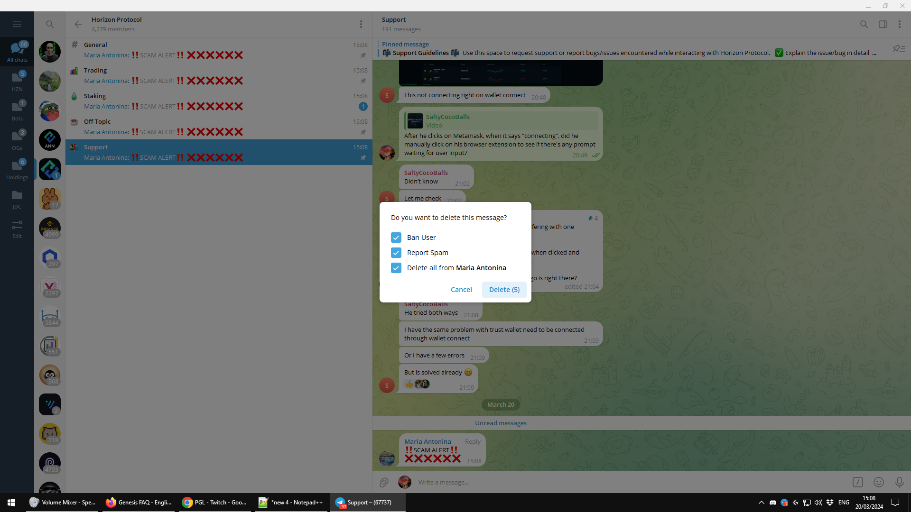

# Adding Liquidity for zUSD and zBNB pools

Adding liquidity to the zUSD-USDC and zBNB-BNB pairs on Wombat Exchange supports a decentralized on-off ramp to the Horizon Protocol ecosystem.\
&#x20;

Being both “stable” pairs consisting of tokens that are designed to be pegged, these pools provide a way to earn yield with low impermanent loss risk.\
\
The following is a step by step guide on how to add liquidity to the zUSD and zBNB pools on Wombat Exchange.&#x20;

## **Prerequisites:**

\- You will need to set up a BEP 20 compatible wallet, like Metamask, Trust Wallet or Binance Extension Wallet.\
\
\- Make sure to have some BNB in your wallet to pay for the gas fees in transactions. &#x20;

\- You will not gain yields by simply providing liquidity on Wombat; you must stake your assets to start reaping the rewards.

## Step by step guide

1\. Connect your wallet on BNB Chain (a.k.a Binance Smart Chain) to Wombat Exchange: app.wombat.exchange\
\
Then click the POOL tab on the panel to visit the pool page.

<figure><figcaption></figcaption></figure>

2. Locate the pool you wish to deposit to. This is how zUSD and zBNB pool look like

<figure><figcaption></figcaption></figure>

<figure><figcaption></figcaption></figure>

3.  Expand the card for the token of your choice and click LIQUIDITY. We will use zUSD as an example.\

    <figure><figcaption></figcaption></figure>
4.  Enter the desired amount to deposit or stake; you may also click MAX to deposit all of your token balance.\

    <figure><figcaption></figcaption></figure>
5. Once you have entered the amount, transaction specifics will be displayed. After inspecting all details, click APPROVE and confirm the transaction in your wallet to grant Wombat access to the tokens you want to add.\

6. Once you have approved the access to the token, two options will be available (DEPOSIT and DEPOSIT & STAKE) :\
   \
   a. If you wish to provide liquidity and stake on Wombat to start receiving WOM distributions, use DEPOSIT & STAKE and confirm the transaction in your wallet.\
   \
   b. If you wish to provide liquidity without staking the LP tokens, click DEPOSIT and confirm the transaction in your wallet. You can stake the LP tokens later or use an aggregator like Wombex or Magpie.

<figure><figcaption></figcaption></figure>

\*Note: A user can get more LP tokens than the amount deposited. When the coverage ratio deviates from 1, depositors will get a deposit reward as they help converge the coverage ratio. Details can be found at[ Deposit Gain and Withdrawal Fee](https://docs.wombat.exchange/docs/concepts/fees/deposit-gain-and-withdrawal-fee)​\
\
7\. A pop-up message with the details of your transaction will appear requesting for you to approve it in your wallet.\
\
\
&#x20;\
8\. A confirmation message will show once the transaction was successfully submitted\
\
\
\
**Congratulations!** You have successfully added liquidity to the zUSD-USDC or zBNB-BNB pools on Wombat Exchange.

## **Withdraw**

In order to withdraw your tokens, you can navigate to the pools where you deposited liquidity and select the token of your choice. Then click on LIQUIDITY and select WITHDRAW, select the amount and follow similar steps to the deposit guide.&#x20;

Wombat allows users to choose which assets they wish to withdraw from the liquidity pools. It is equivalent to a withdrawal followed by a swap.

For example, if you have deposited USDC in the zUSD pool, you can withdraw in the tokens of your choice, i.e., USDC or zUSD.
