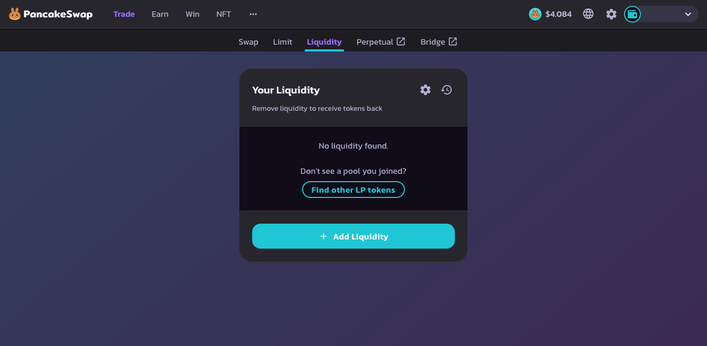

# Remove LP Tokens for zUSD-BUSD Pool

### Remove LP Tokens

Removing consists of performing the steps 2 and 3 in reverse order.

1. In Genesis's Earn tab ([https://genesis.horizonprotocol.com/earn](https://genesis.horizonprotocol.com/earn)), remove the LP tokens from the Earn tab by pressing the "-" button, filling in the input with the number of tokens to remove, then clicking "UNSTAKE".
2. Click on the link at the bottom of the Earn box that says "GET ZUSD-BUSD LP TOKENS"([https://pancakeswap.finance/add/0xe9e7CEA3DedcA5984780Bafc599bD69ADd087D56/0xF0186490B18CB74619816CfC7FeB51cdbe4ae7b9](https://pancakeswap.finance/add/0xe9e7CEA3DedcA5984780Bafc599bD69ADd087D56/0xF0186490B18CB74619816CfC7FeB51cdbe4ae7b9)) and click the back button next to "Add Liquidity". This will take you to the "Your Liquidity" page. Your LP tokens should be visible here if they have been unstaked. You can then remove liquidity to get zUSD and BUSD back.

<figure><figcaption>
"Your Liquidity" page.
</figcaption></figure>
