# Setting Up Chainlink Automation

Welcome to the Guide for using Chainlink Automation to auto-claim your weekly staking rewards on Horizon Genesis.

The following guide will take you through the process of setting Chainlink Automation up (screenshots from 2022.09.18).


Note that setting up Chainlink Automation for Horizon Genesis will help with auto-claiming, but it does not auto-burn to fix your C-Ratio.&#x20;

We will be looking into how to potentially include auto-burning into the Chainlink Automation contract so it can be completely hands-off in the future.


#### Chainlink Automation Quick Start

[Step 0. Grant Contract Authorization](setting-up-chainlink-automation.md#step-0.-grant-contract-authorization)\
[Step 1. Get LINK BEP-20 Tokens](setting-up-chainlink-automation.md#step-1.-get-link-bep-20-tokens)\
[Step 2. Convert LINK BEP-20 to BEP-677](setting-up-chainlink-automation.md#step-2.-convert-link-bep-20-to-bep-677)\
[Step 3. Register Upkeep](setting-up-chainlink-automation.md#step-3.-register-upkeep)\
[Step 4. Auto-Claiming](setting-up-chainlink-automation.md#step-4.-auto-claiming)\
[Optional Step 5. Canceling Your Upkeep](setting-up-chainlink-automation.md#optional-step-5.-canceling-your-upkeep)

### What is Chainlink Automation?

Chainlink Automation is a decentralized automation service. For Horizon Genesis, the way Chainlink Automation works is it will check every block to see if a reward claim is available. If it is, it will automatically claim your rewards for you on your behalf. Each claim transaction will cost LINK tokens, though checking if a claim is available or not is free and will not cost anything.


Before you start, it is important to note that a Chainlink Automation upkeep costs money to maintain. A minimum balance of LINK tokens is required to be stored in an upkeep for it to operate and each weekly claim will deduct a small amount of LINK tokens.

Also, the entire process currently is only supported by MetaMask wallet.


To activate, you need to give the Chainlink Automation upkeep contract permission to take the actions you want and deposit enough money (in the form of ERC-677 LINK tokens) for it to take these actions for you.

For more information about Chainlink Automation, you can read about it here:&#x20;



One of the most important questions will be how many LINK tokens are required to maintain an upkeep. There is specific documentation regarding this available here:&#x20;



### Step 0. Grant Contract Authorization

The pre-requisite step is to allow the Chainlink Automation upkeep contract to claim for you by giving it permission to claim on your behalf.

The target contract address you will be giving permission to is: \
0xa623F29ae4cEd27dFBB39a94152F3184140f6c21

To grant authorization, please follow the following steps:


The following user interface Horizon Genesis is being built and should be online soon.

In the meantime, please scroll down a little to see instructions for authorization via BSCscan.com.


<figure><figcaption>
There is now a new "Authorize" section between "Escrow" and "History". "Authorize" will allow you to select other wallets to be able to perform operations for you.
</figcaption></figure>

<figure><figcaption>
Add the wallet/contract address to authorize and select what permissions to give it. Below in "Manage Authorizations", you can see all permissions that have been given out previously with the ability to remove these permissions at any time. 
</figcaption></figure>

You should get a wallet confirmation screen as shown below.

<figure>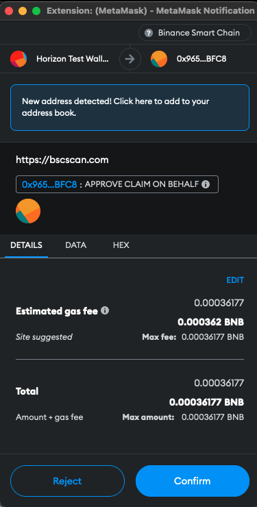<figcaption>
Your wallet will ask you to confirm.
</figcaption></figure>

Once confirmed, authorization will have been completed.

### Step 1. Get LINK BEP-20 Tokens

The first thing you will need to do to create a Chainlink Automation Upkeep is to acquire LINK tokens.

1. You can acquire LINK BEP-20 tokens at DEXs, such as PancakeSwap, or CEXs, such as Binance. It is recommended to buy at least **10 LINK tokens** to maintain your Auto-Claim Upkeep. This balance could maintain your upkeep for about 4-5 months, but the true duration is based on market prices.
2. If you are buying LINK tokens on a CEX, such as Binance, make sure you are withdrawing the LINK onto the BNB Chain (BEP-20 token) and not withdrawing onto the Ethereum chain (ERC-20 token). Since the Chainlink Automation upkeep is operating on the BNB Chain for Horizon Protocol, it must be a BEP-20 LINK token.

The screenshots below will focus on using PancakeSwap to buy LINK BEP-20 tokens:



<figure>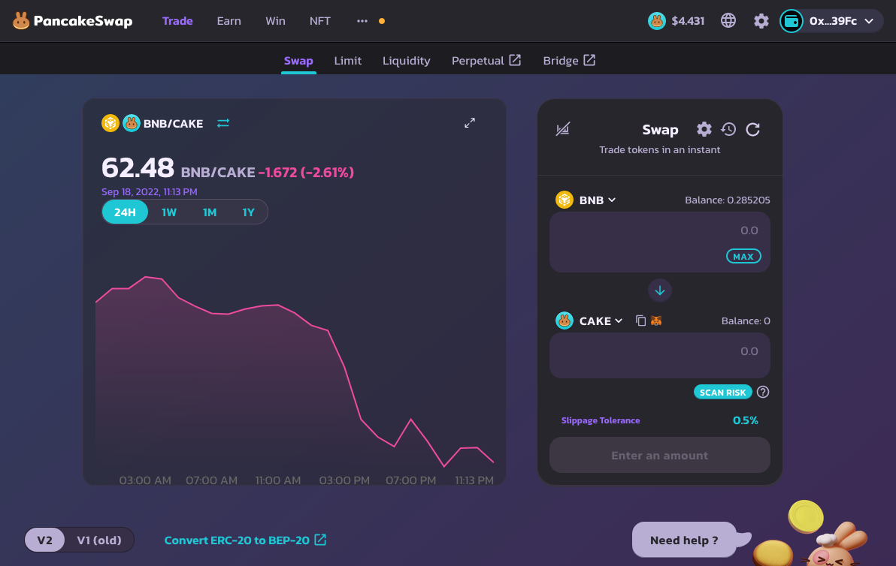<figcaption>
Connect your wallet to PancakeSwap. Click on "CAKE" on the right side Swap section of the page to open the modal.
</figcaption></figure>

<figure>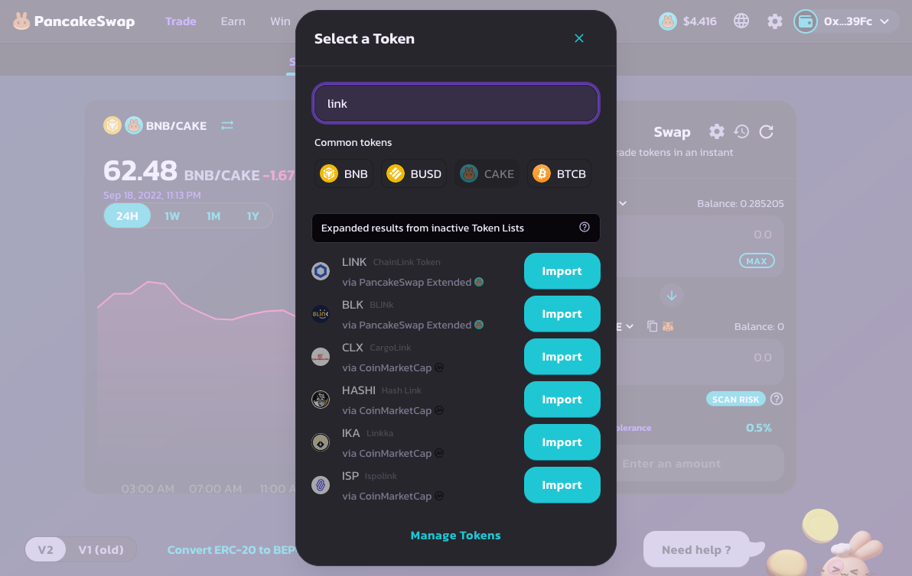<figcaption>
Find the LINK token. You can access this modal by clicking on a token on the Swap screen. Search for LINK. Click Import.
</figcaption></figure>

<figure>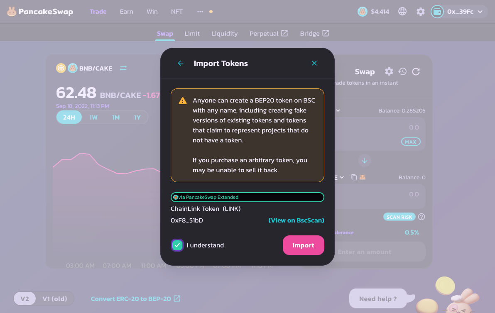<figcaption>
After clicking Import, you will see this. Check "I understand" and then click "Import".
</figcaption></figure>

<figure>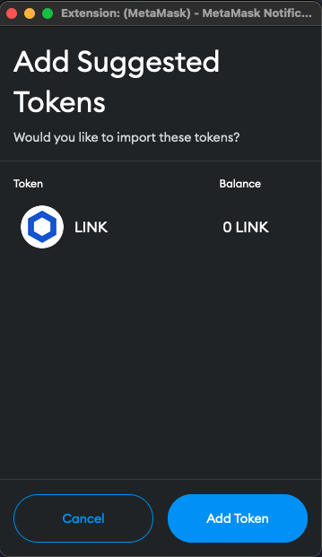<figcaption>
If you are using MetaMask, you will see the following pop up. Click Add Token.
</figcaption></figure>

<figure>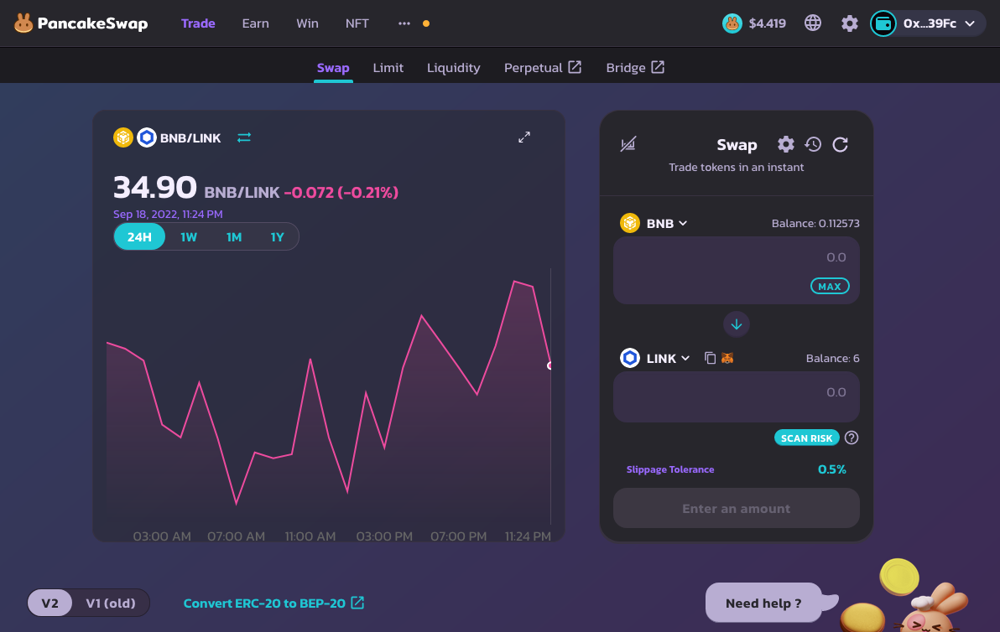<figcaption>
You will now see LINK selected in the Swap section of the page. Enter the amount you want to trade for.
</figcaption></figure>

<figure>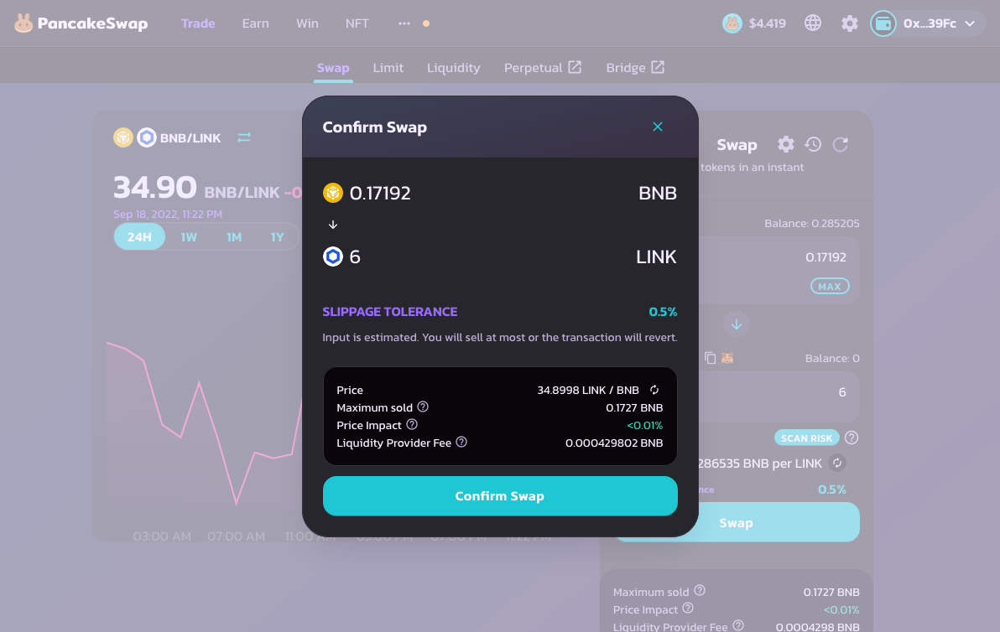<figcaption>
We will be trading for 6 LINK with BNB.
</figcaption></figure>

<figure>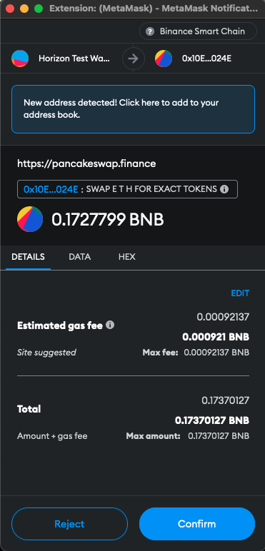<figcaption>
The MetaMask transaction (to show approximate fees involved).
</figcaption></figure>

<figure>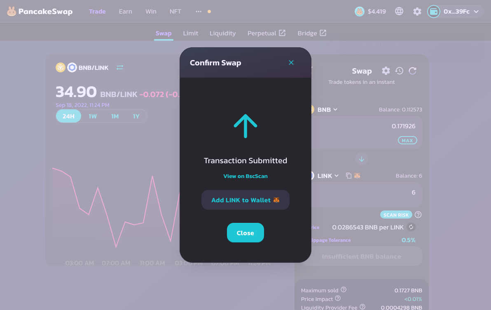<figcaption>
Once the Transaction has been submitted, you will get this screen. If LINK is not already in your wallet as a token, you can click "Add LINK to Wallet". You can also always click the MetaMask fox logo in the Swap section to prompt adding the token to your wallet.
</figcaption></figure>

### Step 2. Convert LINK BEP-20 to BEP-677

Chainlink Automation uses a special wrapped ERC-677 format, which allows you to include additional data along with the contract. This functionality is required for Chainlink Automation upkeep to be able to perform its decentralized automation.

In this step, we will be converting LINK BEP-20 into a LINK BEP-677 token.


Fun fact: the LINK BEP-677 token is a wrapped ERC677 token, which is a synthetic asset that uses the original BEP-20 token as collateral.


To convert, we will be going to the following website:



<figure>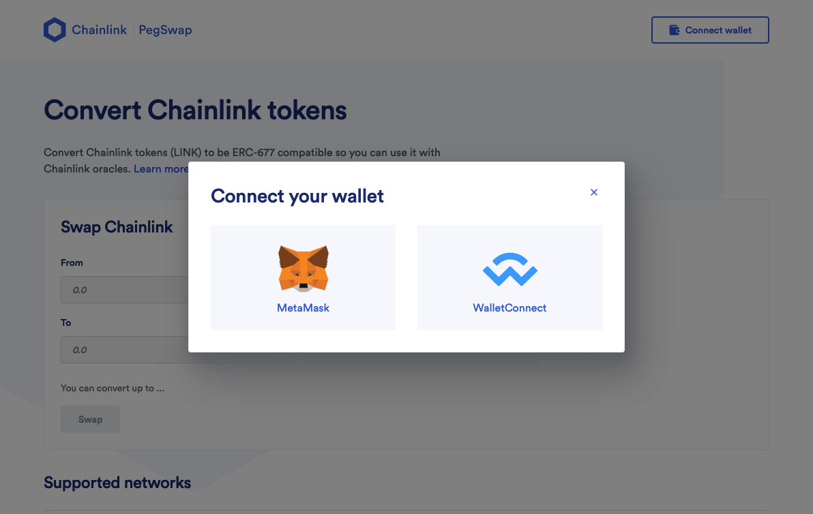<figcaption>
When you first get to https://pegswap.chain.link/, you will need to connect your wallet.
</figcaption></figure>

<figure><figcaption>
Connect your wallet to Pegswap. Always confirm that the address is correct.
</figcaption></figure>

<figure>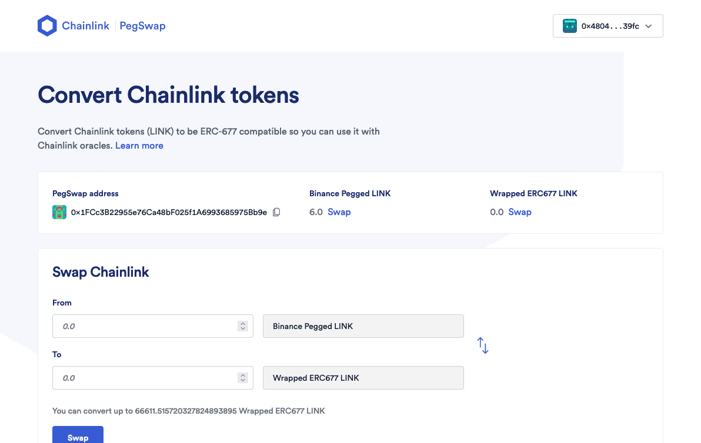<figcaption>
Once your wallet is connected, you can go ahead and type in what you want to swap. Your wallet should show and you should see Binance Pegged LINK and Wrapped ERC677 LINK in the "Swap Chainlink" section.
</figcaption></figure>

<figure>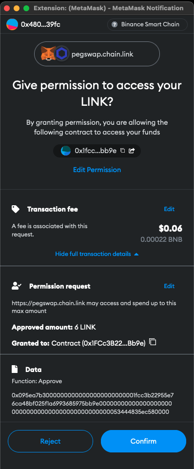<figcaption>
When you click Swap, this will show up in your wallet (this is in MetaMask, other wallets might be slightly different). You will need to give it permission. In this guide, we will be converting all of our LINK BEP-20 (all 6 tokens).
</figcaption></figure>

<figure>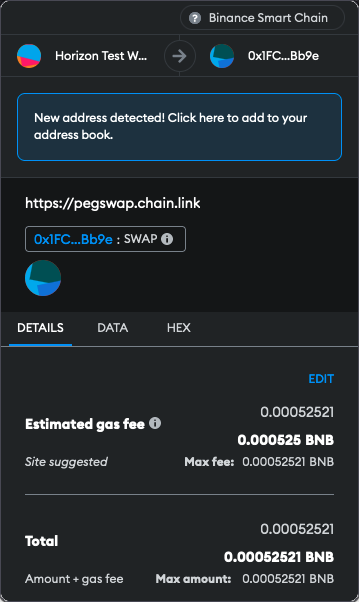<figcaption>
Here are the transaction fees. Click confirm (off screen to the bottom) to finish the Swap.
</figcaption></figure>

After a successful swap, the pegchain page will typically freeze. Just refresh it (this is a known bug) and it should show your tokens have swapped.&#x20;

Lastly, if you want to add the token to your Metamask wallet, this is the Wrapped ERC677 LINK token address for the BNB Chain: 0x404460C6A5EdE2D891e8297795264fDe62ADBB75

More details on the contract address here:



### Step 3. Register Upkeep

We are at the final step of this process.

We will now register your upkeep:&#x20;



<figure>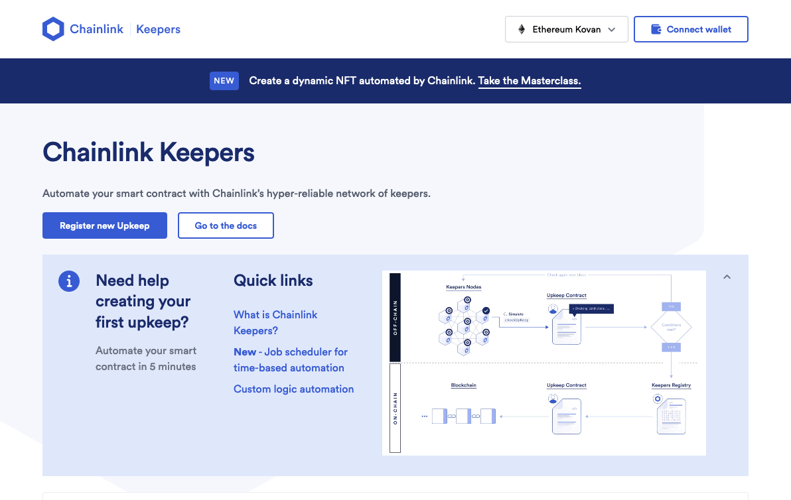<figcaption>
This is the Chainlink Automation page.
</figcaption></figure>

<figure>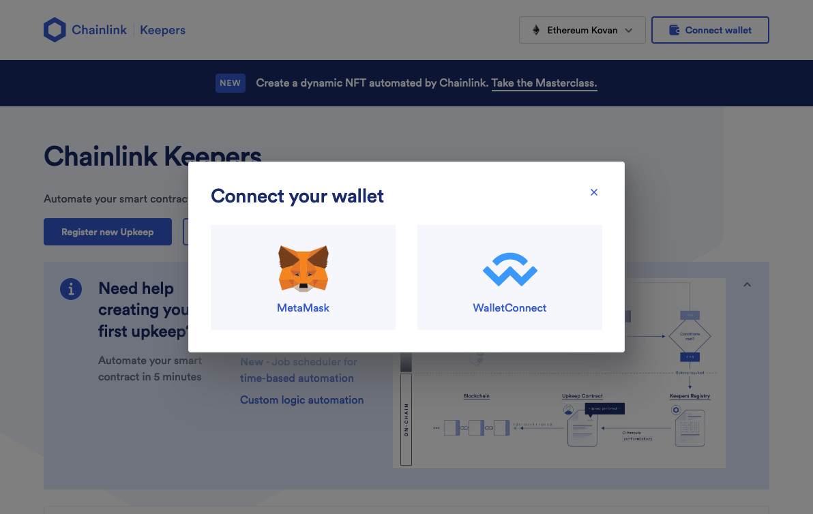<figcaption>
Connect your wallet. Currently only supports MetaMask.
</figcaption></figure>

<figure>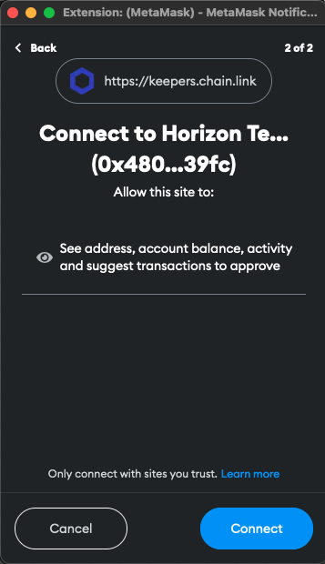<figcaption>
MetaMask pop up to Connect.
</figcaption></figure>

<figure>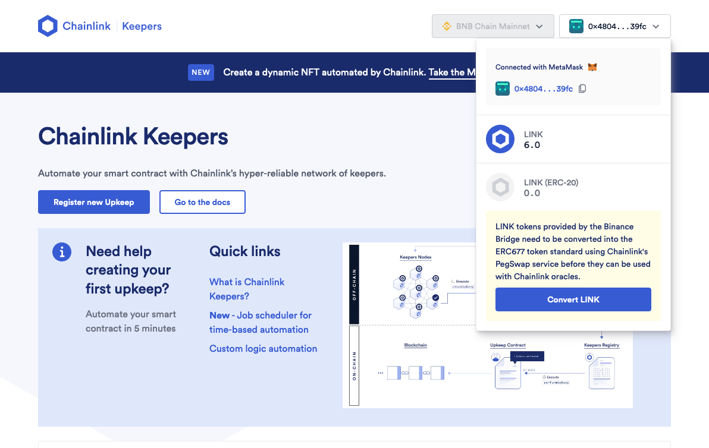<figcaption>
After connecting, you should be able to click on your wallet to confirm that you already have LINK tokens ready. Next, click "Register new Upkeep" to get started.
</figcaption></figure>

<figure>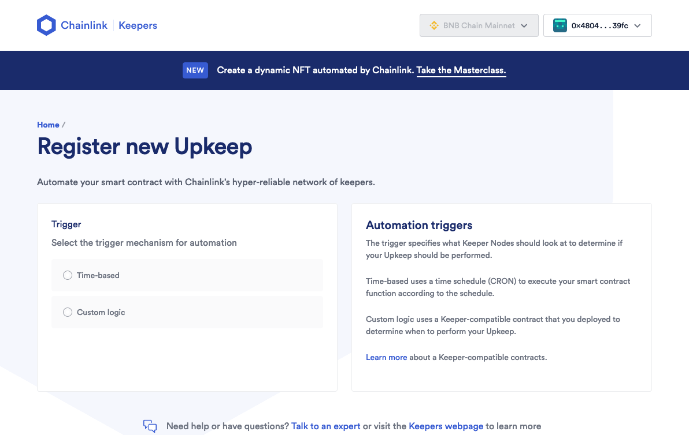<figcaption>
Select "Custom logic".
</figcaption></figure>

<figure>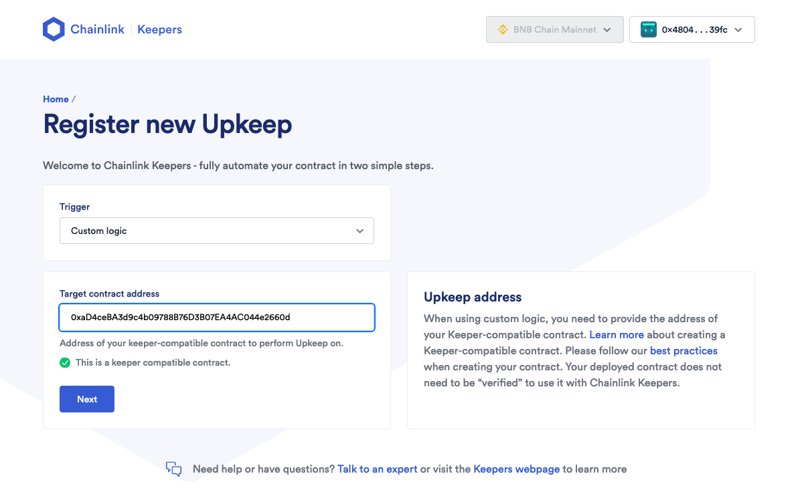<figcaption>
Input the Target contract address (address available below).
</figcaption></figure>

Target contract address: 0xa623F29ae4cEd27dFBB39a94152F3184140f6c21

<figure>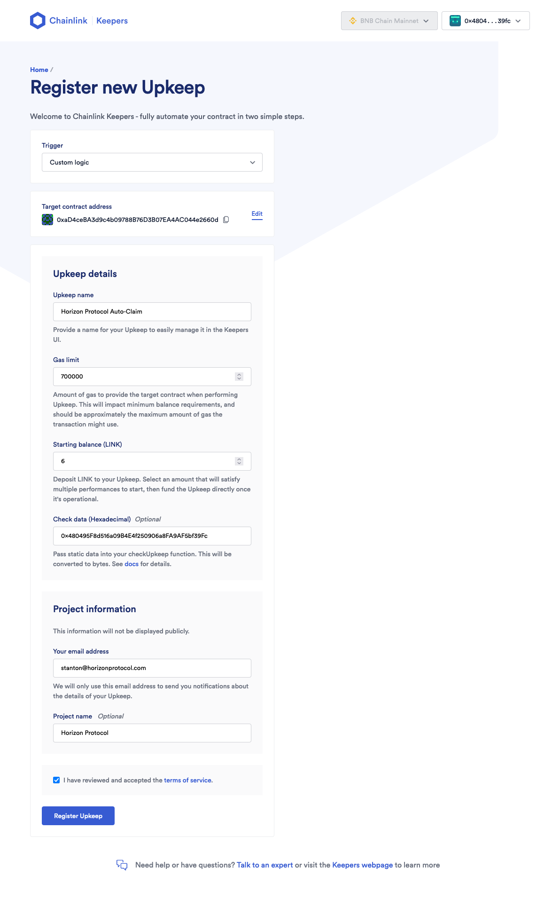<figcaption>
Fill in the above information and then click "Register Upkeep". Information details below.
</figcaption></figure>

Information to be written above:

* **Upkeep Name**: Horizon Protocol Auto-Claim\
  (limited length, you can choose whatever name)
* **Gas limit**: 700,000\
  (gas limit will be higher than how much it would cost to just claim directly because it is a contract calling another contract. Typical gas required for small transactions are around 250000, within the same order of magnitude. It is kind of weird to see 2300 as a gas limit written in the text box.)
* **Starting Balance** (LINK): 10+ \
  (add how much LINK, the wrapped ERC677 ones, that you want to deposit into your upkeep. It is recommended to deposit at least 10 as the Minimum Balance to maintain the upkeep can fluctuate based on market prices)
* Check data (Hexadecimal): Your Wallet Address \
  (Is the public address of your wallet you want to claim rewards on)
* Your email address\
  (Email Needed for Upkeep notifications)

The above information can be changed later, but it will cost a transaction.

<figure>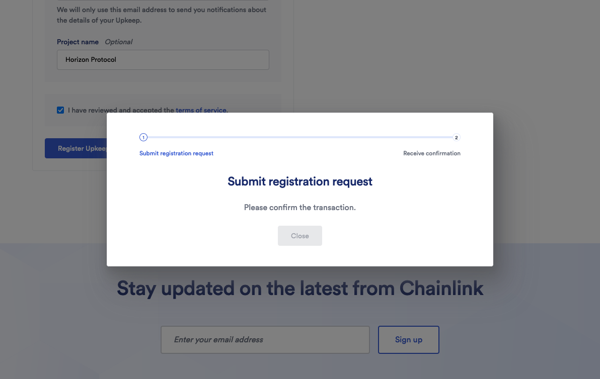<figcaption>
Once you click "Register Upkeep", the submission will be in process and your MetaMask will prompt you for confirmation.
</figcaption></figure>

<figure>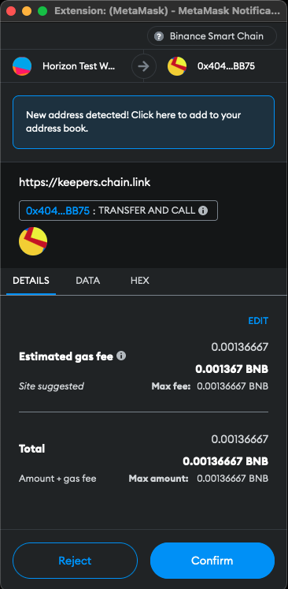<figcaption>
MetaMask confirmation with transaction cost.
</figcaption></figure>

<figure>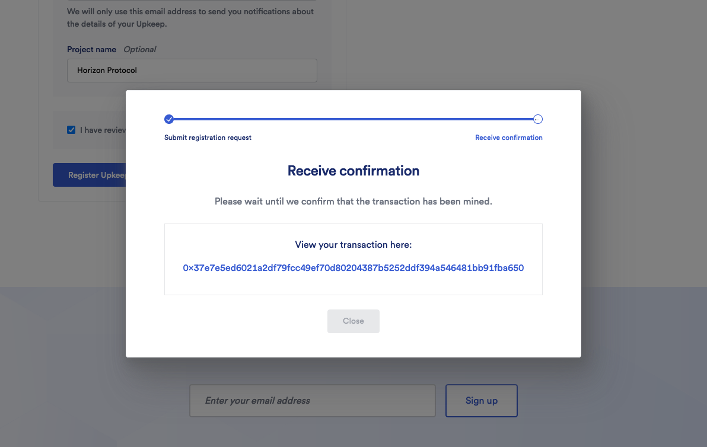<figcaption>
Once confirmed, the Upkeep page will look like this. Please wait until the transaction is confirmed.
</figcaption></figure>

<figure><figcaption>
Once the transaction confirmed, you will see this.
</figcaption></figure>

<figure>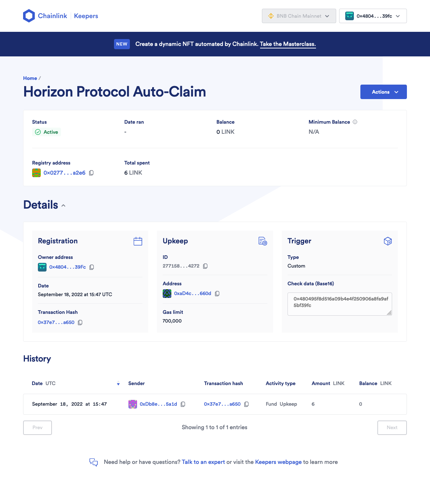<figcaption>
Upon completion, your Upkeep page should look like this, with "Status" showing "Active".
</figcaption></figure>

If everything is set up properly and you have rewards to claim with the proper C-Ratio, the Upkeep should immediately claim your rewards for you.

Remember to refresh your Upkeep page until the "Minimum Balance" shows up. "Balance" should also show up.

Random information about min-balance:&#x20;


&#x20;\[gas limit] \* \[current gas price] \* \[gasCeilingMultiplier]


### Step 4. Auto-Claiming

This isn't really a step, but just showing how the Auto-Claiming will work.

<figure>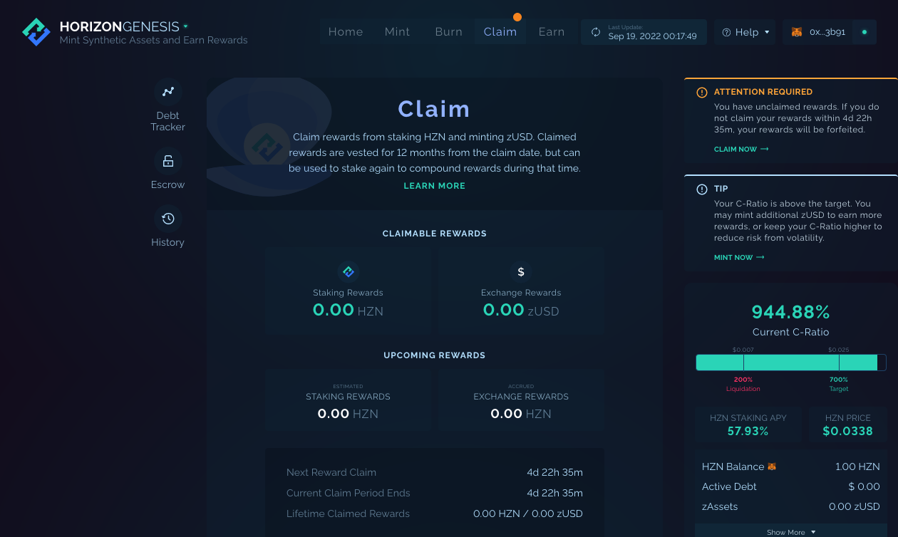<figcaption>
If you had not claimed before you set up an Upkeep and a Claim was available, this is what your Claim page will look like before.
</figcaption></figure>

<figure>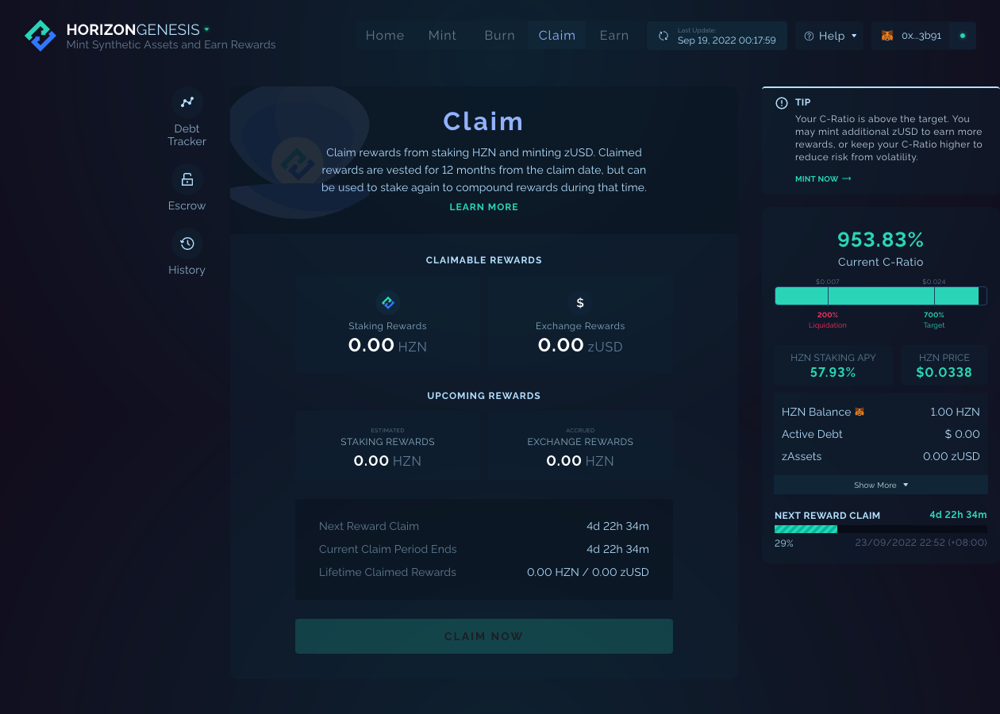<figcaption>
And this is what your Claim page will look like after (basically, you didn't click "Claim Now" because your Upkeep claimed for you). Note that the Upkeep can only Claim when you have the proper C-Ratio. The Upkeep currently cannot auto-burn for you.
</figcaption></figure>

<figure>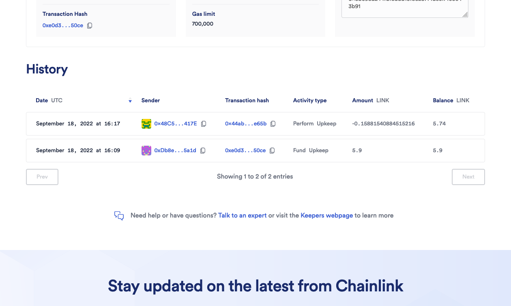<figcaption>
If you go to https://automation.chain.link/, you will see "Perform Upkeep" in History.
</figcaption></figure>

<figure>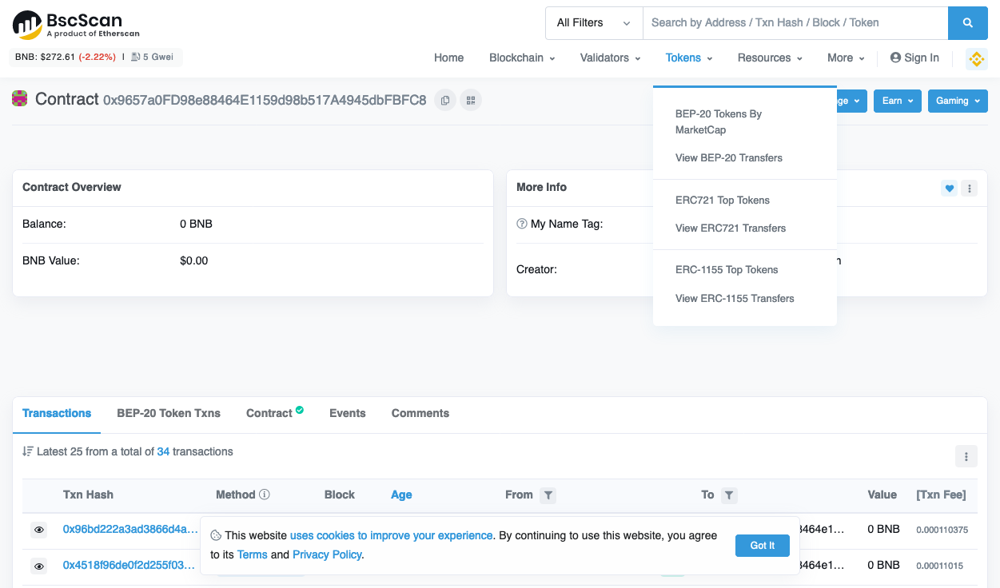<figcaption>
If you go to <a href="https://bscscan.com/address/0x9657a0FD98e88464E1159d98b517A4945dbFBFC8">https://bscscan.com/address/0x9657a0FD98e88464E1159d98b517A4945dbFBFC8</a>, you should also be able to see your automated transaction.
</figcaption></figure>

For reference, the automated Upkeep transaction cost $1.22 ($0.95 + 30% premium). The 30% premium on BNB Chain is lower than on any of the other chains (can compare here:&#x20;



The above Upkeep transaction can also be found here:&#x20;



### Optional Step 5. Canceling Your Upkeep

The final step is for canceling Upkeeps. Canceling your Upkeep consists of two parts:

1. Cancel Upkeep
2. Withdraw Funds

We can start this step by going back to [https://automation.chain.link/bsc](https://automation.chain.link/bsc). Make sure your wallet is connected.

<figure>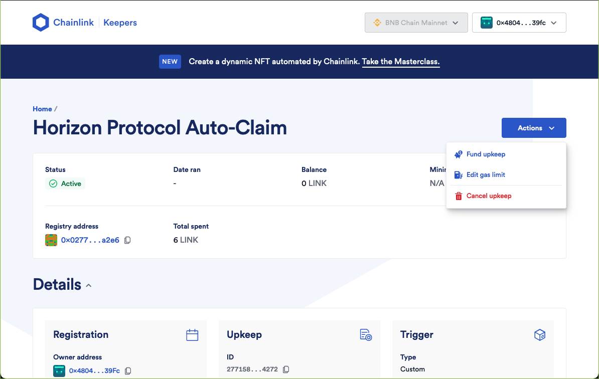<figcaption>
Click on "Actions", and then "Cancel upkeep".
</figcaption></figure>

<figure>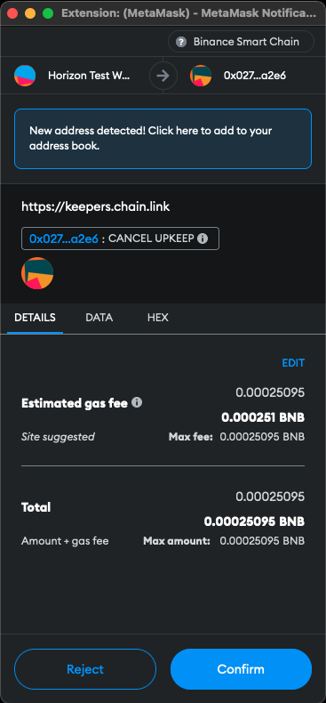<figcaption>
MetaMask prompt for confirmation.
</figcaption></figure>

<figure>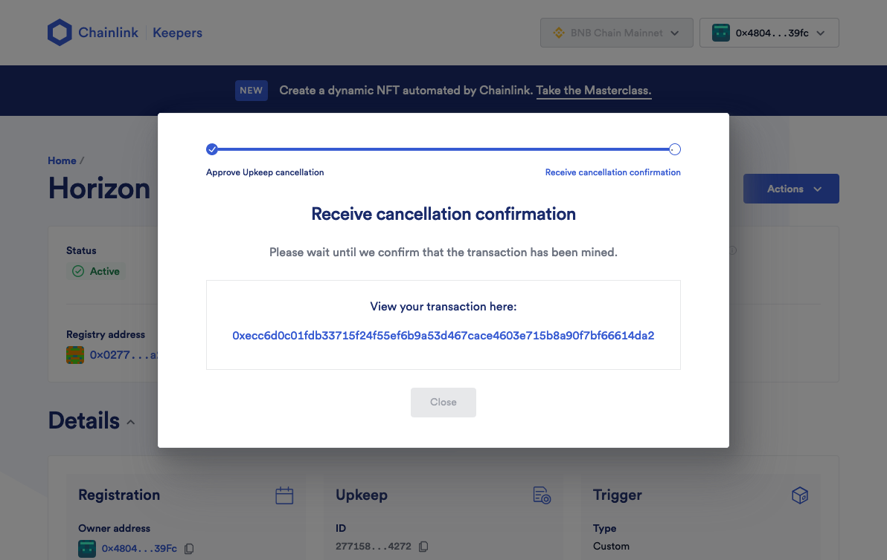<figcaption>
Waiting for final confirmation.
</figcaption></figure>

<figure>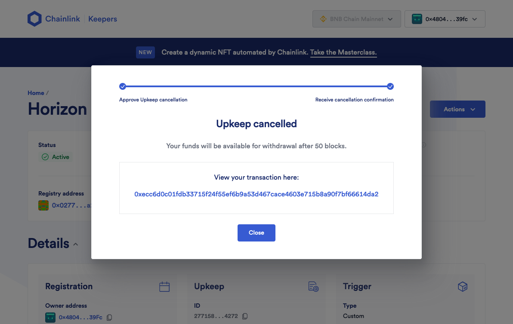<figcaption>
Transaction confirmation that upkeep is cancelled.
</figcaption></figure>

<figure>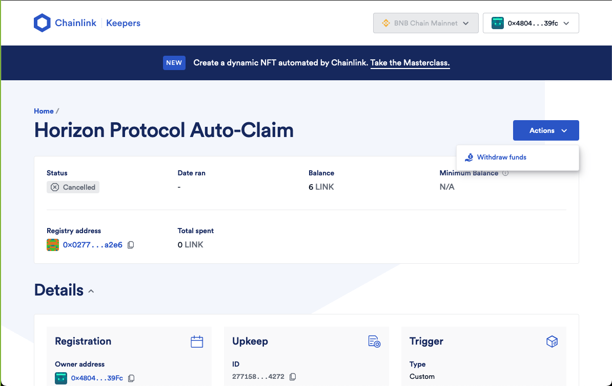<figcaption>
Your "Status" should now say "Cancelled". Click on "Actions" to "Withdraw funds".
</figcaption></figure>

<figure>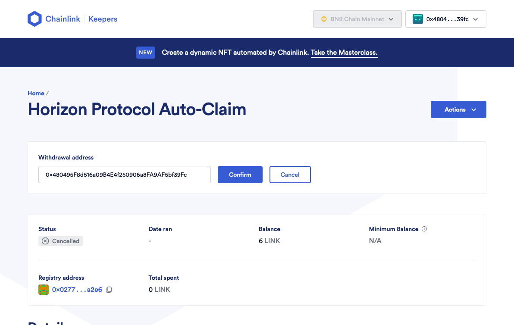<figcaption>
Confirm the "Withdrawal address" is your wallet. Click Confirm.
</figcaption></figure>

<figure>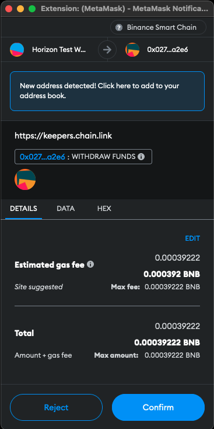<figcaption>
MetaMask confirmation screen.
</figcaption></figure>

<figure>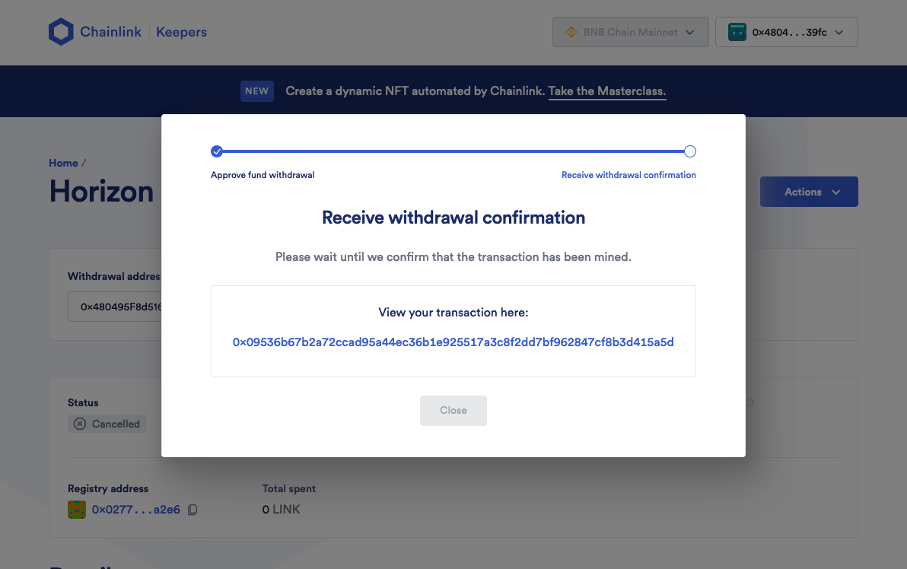<figcaption>
Waiting for transaction confirmation.
</figcaption></figure>

<figure>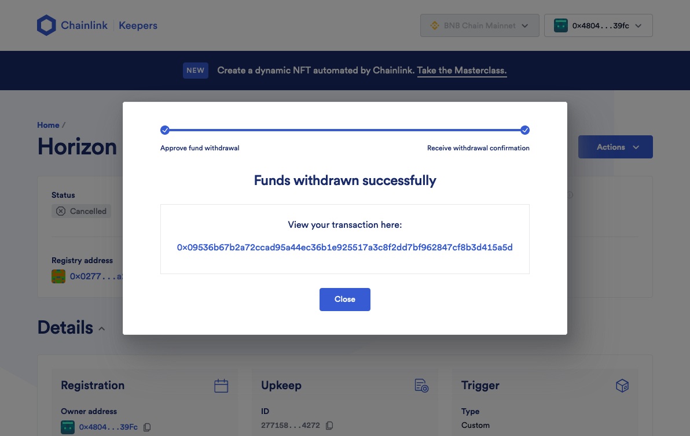<figcaption>
Funds withdrawn.
</figcaption></figure>

The process for Cancel Upkeep and Withdraw Funds will lose you a bit of LINK (in this case, we went from 6 --> 5.9).

If you check your wallet, you should see your LINK there. Note that this is still the Wrapped LINK ERC677 token. You will need to go to Step 2. and perform a reverse swap to get back LINK BEP-20 tokens.
