# Setting Up Chainlink Keepers

Welcome to the Guide for using Chainlink Keepers to auto-claim your weekly Horizon Genesis staking rewards.

The following guide will take you through the process of setting Chainlink Keepers up (screenshots from 2022.09.18).


Note that setting up Chainlink Keepers for Horizon Genesis will help with auto-claiming, but it does not auto-burn to fix your C-Ratio.&#x20;

We will be looking into how to potentially include auto-burning into the Keepers contract so it can be completely hands-off in the future.


### What is Chainlink Keepers?

Chainlink Keepers is a decentralized automation service. For Horizon Genesis, the way Keepers works is it will check every block to see if Claim is available. If it is, it will automatically claim for you. Each claim will cost LINK tokens, though checking is free and will not cost anything.


Before you start, it is important to note that Keepers cost money to upkeep. A certain amount of LINK tokens need to be stored in Keepers and each weekly claim will deduct from your LINK tokens.

Also, the entire process currently is only supported by MetaMask wallet.


To activate, you need to give Keepers permission to take the actions you want and deposit enough money (in the form of Link tokens and whatever tokens you need for your transactions) for it to take these actions for you.

For more information about Chainlink Keepers, you can read about it here: [https://docs.chain.link/docs/chainlink-keepers/introduction/](https://docs.chain.link/docs/chainlink-keepers/introduction/)

One of the most important questions will probably be how much LINK tokens you need to get. There is specific documentation regarding this available here:\
[https://docs.chain.link/docs/chainlink-keepers/supported-networks/](https://docs.chain.link/docs/chainlink-keepers/supported-networks/#bnb-chain)#bnb[-chain](https://docs.chain.link/docs/chainlink-keepers/supported-networks/#bnb-chain)

### Step 0. Grant Contract Authorization

The pre-requisite step is to allow Chainlink Keepers to claim for you by giving it permission.

The target contract address you will be giving permission to is: 0xaD4ceBA3d9c4b09788B76D3B07EA4AC044e2660d

To grant authorization, please follow the following steps:


The following user interface Horizon Genesis is being built and should be online soon.

In the meantime, please scroll down a little to see instructions for authorization via BSCScans.


<figure><figcaption>
There is now a new "Authorize" section between "Escrow" and "History". "Authorize" will allow you to select other wallets to be able to perform operations for you.
</figcaption></figure>

<figure><figcaption>
Add the wallet address to authorize. You can also select what permissions to give them. Below in "Manage Authorizations", you can see all permissions that have been given out previously with the ability to remove these permissions at any time. 
</figcaption></figure>

In the meantime, before the "Authorize" tab is built, you can activate authorization by going to: [https://bscscan.com/address/0x9657a0FD98e88464E1159d98b517A4945dbFBFC8](https://bscscan.com/address/0x9657a0FD98e88464E1159d98b517A4945dbFBFC8)

<figure><figcaption>
Click on "Contract" (where the green checkmark is) to see the above page. Link your wallet by clicking "Connect to Web3". Once connected, it should show a green dot and say "Connected - Web3" with your wallet address behind it. Input the contract address to "4. approveClaimOnBehalf" and then click "Write".
</figcaption></figure>

<figure>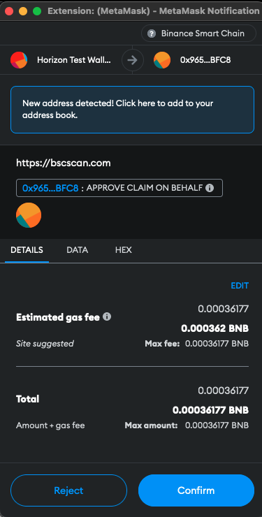<figcaption>
Your wallet will ask you to confirm.
</figcaption></figure>

Once confirmed, authorization will have been completed.

### Step 1. Get LINK BEP-20 Tokens

The first thing you will need to do for Chainlink Keepers is to acquire LINK tokens.

1. You can acquire LINK BEP-20 tokens at DEXs, such as PancakeSwap, or CEXs, such as Binance.
2. Make sure that you are buying the BEP-20 token (BNB Chain token) and not the ERC-20 token (Ethereum token). Since Keepers will need to be operating on the BNB Chain for Horizon Protocol, it must be the BEP-20 token.

The screenshots below will focus on using PancakeSwap to buy LINK BEP-20 tokens:\
[https://pancakeswap.finance/](https://pancakeswap.finance/)

<figure>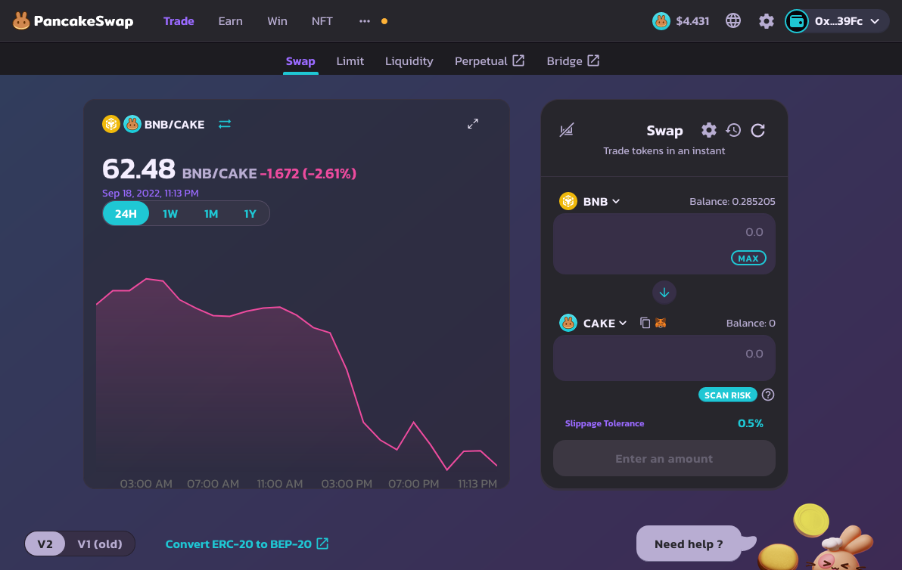<figcaption>
Connect your wallet to PancakeSwap. Click on "CAKE" on the right side Swap section of the page to open the modal.
</figcaption></figure>

<figure>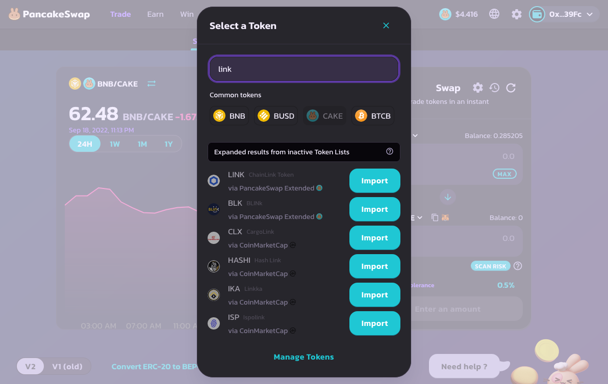<figcaption>
Find the LINK token. You can access this modal by clicking on a token on the Swap screen. Search for LINK. Click Import.
</figcaption></figure>

<figure>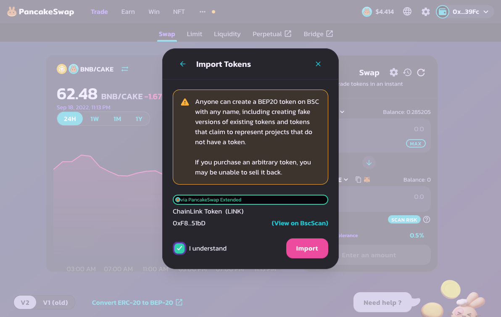<figcaption>
After clicking Import, you will see this. Check "I understand" and then click "Import".
</figcaption></figure>

<figure>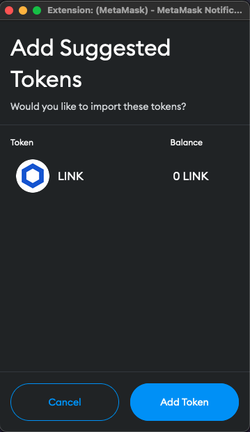<figcaption>
If you are using MetaMask, you will see the following pop up. Click Add Token.
</figcaption></figure>

<figure>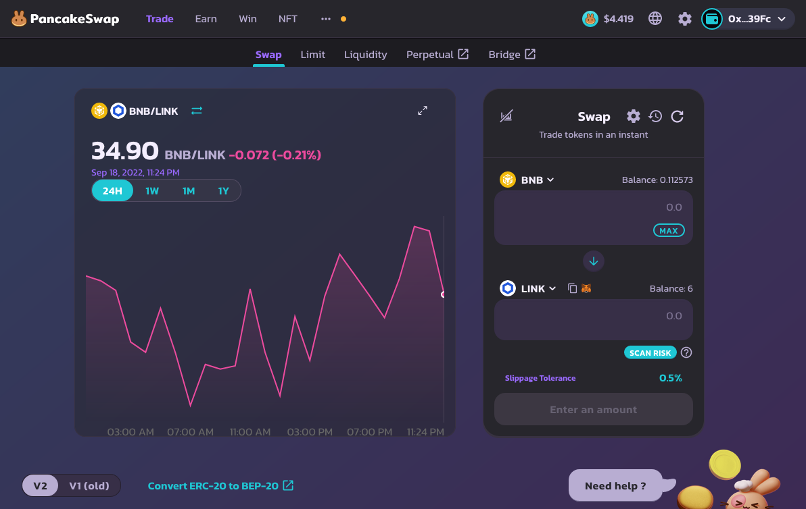<figcaption>
You will now see LINK selected in the Swap section of the page. Enter the amount you want to trade for.
</figcaption></figure>

<figure>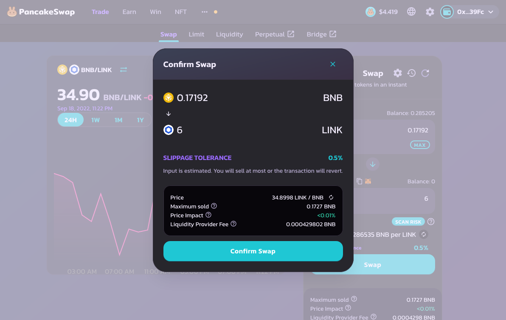<figcaption>
We will be trading for 6 LINK with BNB.
</figcaption></figure>

<figure>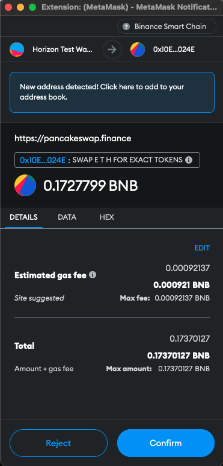<figcaption>
The MetaMask transaction (to show approximate fees involved).
</figcaption></figure>

<figure><figcaption>
Once the Transaction has been submitted, you will get this screen. If LINK is not already in your wallet as a token, you can click "Add LINK to Wallet". You can also always click the MetaMask fox logo in the Swap section to prompt adding the token to your wallet.
</figcaption></figure>

### Step 2. Convert LINK BEP-20 to BEP-677

Chainlink Keepers uses a special wrapped ERC677 format, which allows you to include additional data along with the contract. This functionality is required for Keepers to be able to perform decentralized automation.

In this step, we will be converting LINK BEP-20 into a LINK BEP-677 token.


Fun fact: the LINK BEP-677 token is a wrapped ERC677 token, which is a synthetic asset that uses the original BEP-20 token as collateral.


To convert, we will be going to the following website: [https://pegswap.chain.link/](https://pegswap.chain.link/)

<figure>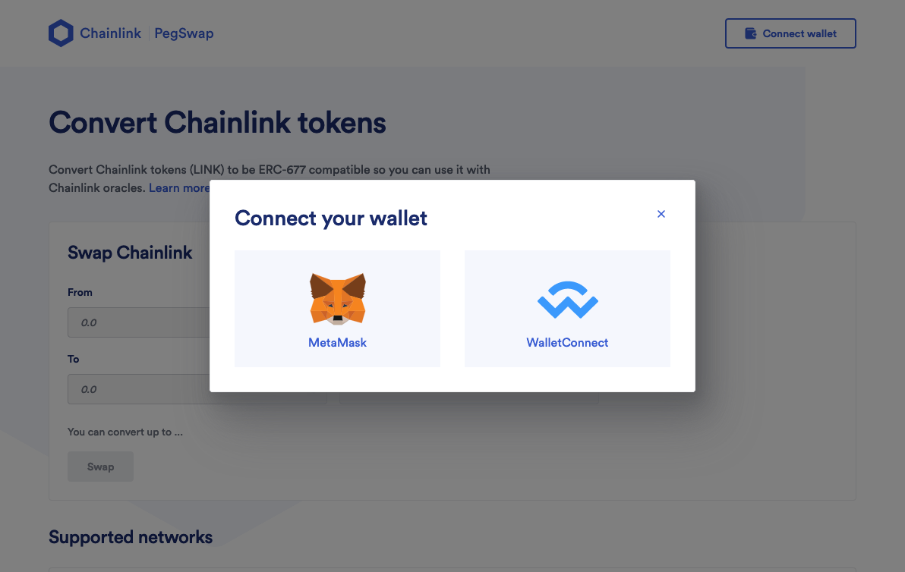<figcaption>
When you first get to https://pegswap.chain.link/, you will need to connect your wallet.
</figcaption></figure>

<figure><figcaption>
Connect your wallet to Pegswap. Always confirm that the address is correct.
</figcaption></figure>

<figure><figcaption>
Once your wallet is connected, you can go ahead and type in what you want to swap. Your wallet should show and you should see Binance Pegged LINK and Wrapped ERC677 LINK in the "Swap Chainlink" section.
</figcaption></figure>

<figure>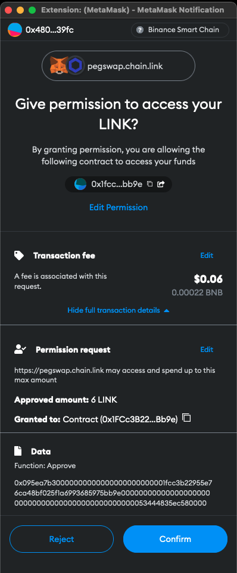<figcaption>
When you click Swap, this will show up in your wallet (this is in MetaMask, other wallets might be slightly different). You will need to give it permission. In this guide, we will be converting all of our LINK BEP-20 (all 6 tokens).
</figcaption></figure>

<figure>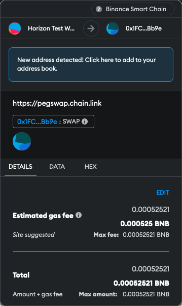<figcaption>
Here are the transaction fees. Click confirm (off screen to the bottom) to finish the Swap.
</figcaption></figure>

After a successful swap, the pegchain page will typically freeze. Just refresh it (this is a known bug) and it should show your tokens have swapped.&#x20;

Lastly, if you want to add the token to your wallet, this is the Wrapped ERC677 LINK contract address for the BNB Chain: 0x404460C6A5EdE2D891e8297795264fDe62ADBB75

More details on the contract address here:\
[https://docs.chain.link/docs/link-token-contracts/#bnb-chain](https://docs.chain.link/docs/link-token-contracts/#bnb-chain)

### Step 3. Register Keepers

We are at the final step of this process.

We will now register your Keepers:\
[https://keepers.chain.link/](https://keepers.chain.link/)

<figure><figcaption>
This is the Chainlink Keepers page.
</figcaption></figure>

<figure>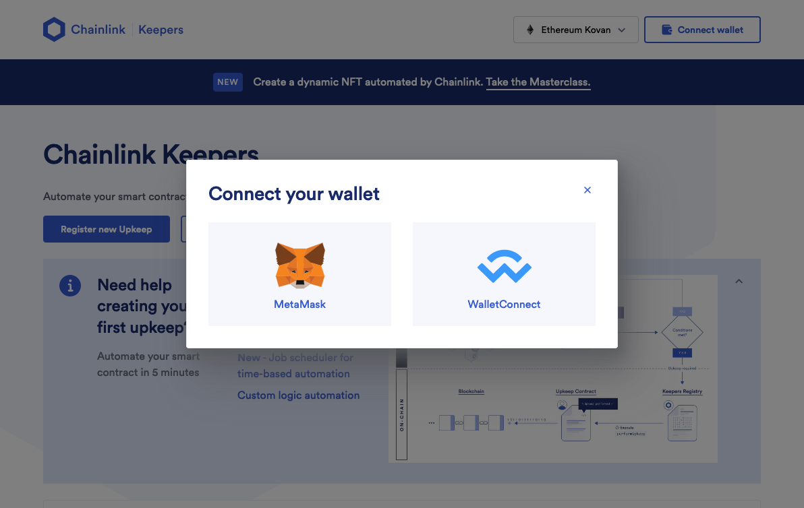<figcaption>
Connect your wallet. Currently only supports MetaMask.
</figcaption></figure>

<figure>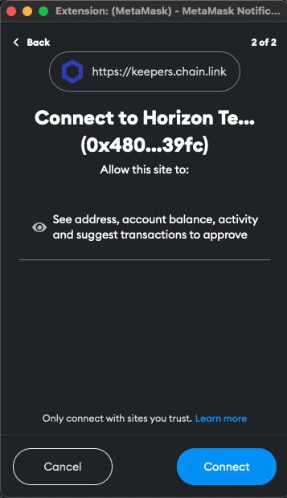<figcaption>
MetaMask pop up to Connect.
</figcaption></figure>

<figure>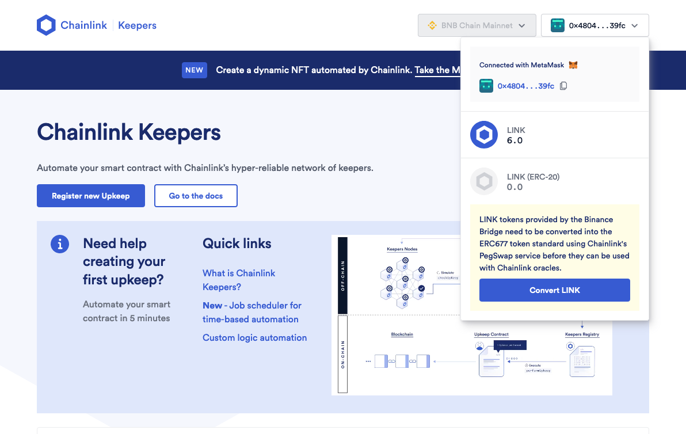<figcaption>
After connecting, you should be able to click on your wallet to confirm that you already have LINK tokens ready. Next, click "Register new Upkeep" to get started.
</figcaption></figure>

<figure>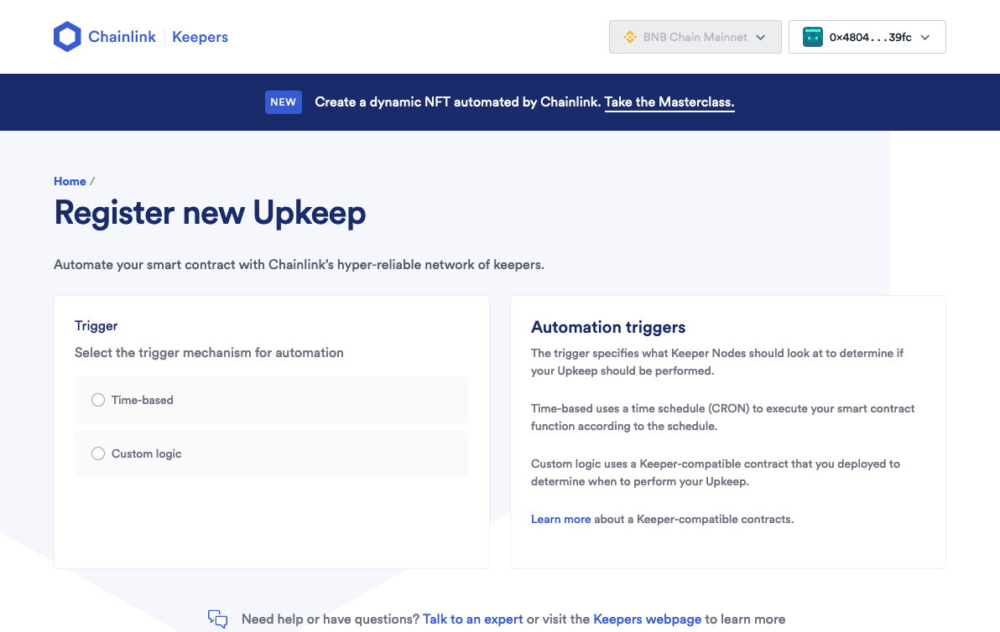<figcaption>
Select "Custom logic".
</figcaption></figure>

<figure>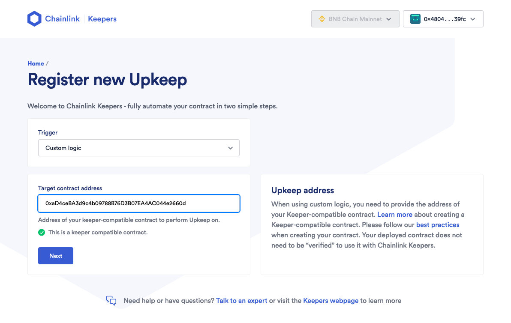<figcaption>
Input the Target contract address (address available below).
</figcaption></figure>

Target contract address: 0xaD4ceBA3d9c4b09788B76D3B07EA4AC044e2660d

<figure>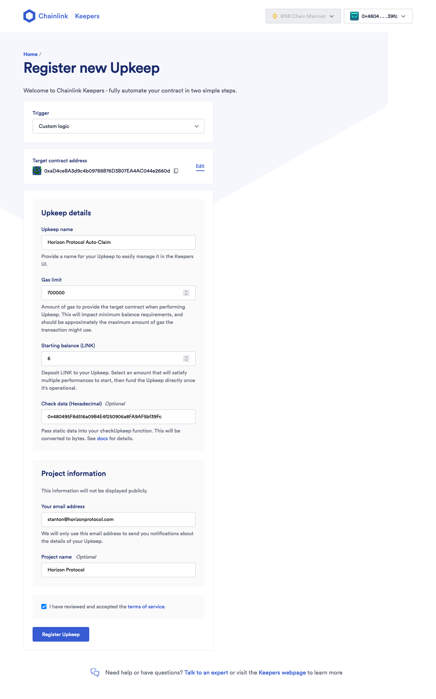<figcaption>
Fill in the above information and then click "Register Upkeep". Information details below.
</figcaption></figure>

Information to be written above:

* Upkeep Name: Horizon Protocol Auto-Claim\
  (limited length, you can choose whatever name)
* Gas limit: 700,000\
  (gas limit will be higher than how much it would cost to just claim directly because it is a contract calling another contract. Typical gas required for small transactions are around 250000, within the same order of magnitude. It is kind of weird to see 2300 as a gas limit written in the text box.)
* Starting Balance (LINK)\
  (add how much LINK, the wrapped ERC677 ones, that you want to deposit into your Keepers)
* Check data (Hexadecimal) \
  (Is the public address of your wallet)
* Your email address\
  (Email Needed for email notifications)

The above information can be changed later, but it will cost a transaction.

<figure><figcaption>
Once you click "Register Upkeep", the submission will be in process and your MetaMask will prompt you for confirmation.
</figcaption></figure>

<figure>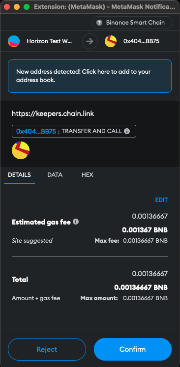<figcaption>
MetaMask confirmation with transaction cost.
</figcaption></figure>

<figure>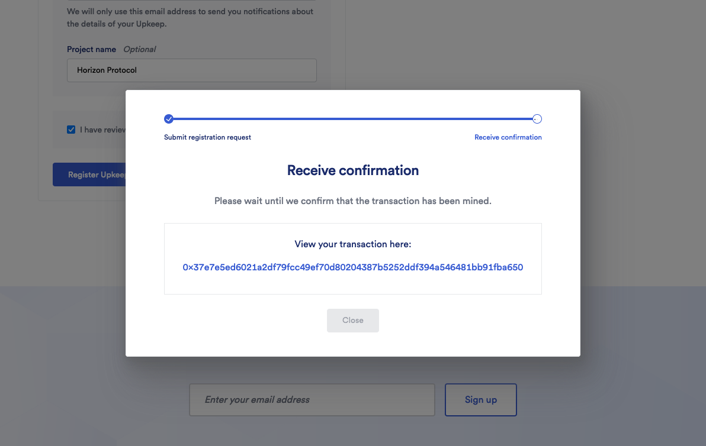<figcaption>
Once confirmed, the Keepers page will look like this. Please wait until Keepers confirms the transaction.
</figcaption></figure>

<figure>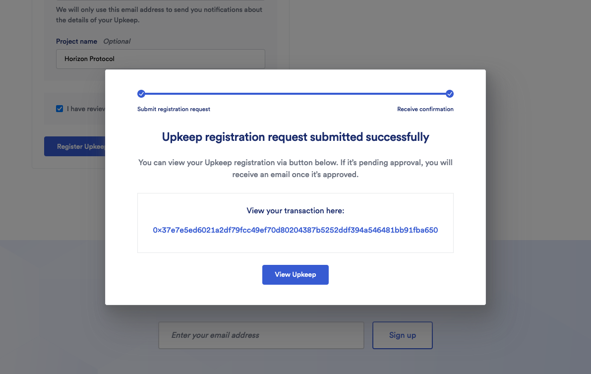<figcaption>
Once the transaction confirmed, you will see this.
</figcaption></figure>

<figure><figcaption>
Upon completion, your Keepers page should look like this, with "Status" showing "Active".
</figcaption></figure>

Remember to refresh your Keepers page until the "Minimum Balance" shows up. "Balance" should also show up.

Random information about min-balance: https://docs.chain.link/docs/chainlink-keepers/keeper-economics/#minimum-balance \[gas limit] \* \[current gas price] \* \[gasCeilingMultiplier]

### Step 4. Auto-Claiming

This isn't really a step, but just showing how the Auto-Claiming will work.

<figure>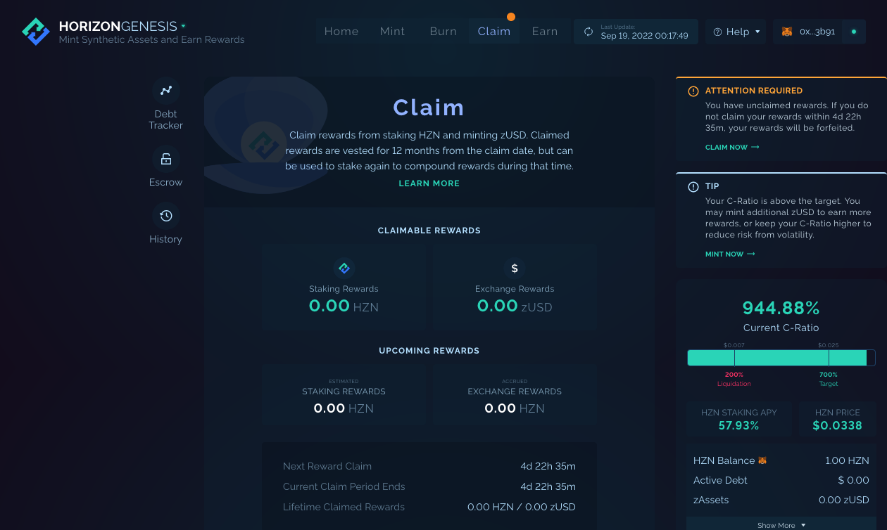<figcaption>
If you had not claimed before you set up Keepers and a Claim was available, this is what your Claim page will look like before.
</figcaption></figure>

<figure>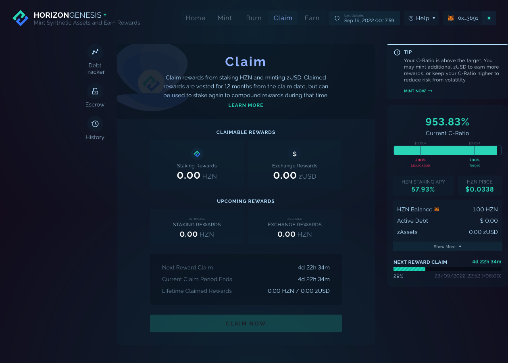<figcaption>
And this is what your Claim page will look like after (basically, you didn't click "Claim Now" because Keepers claimed for you). Note that Keepers can only Claim when you have the proper C-Ratio. Keepers currently cannot auto-burn for you.
</figcaption></figure>

<figure>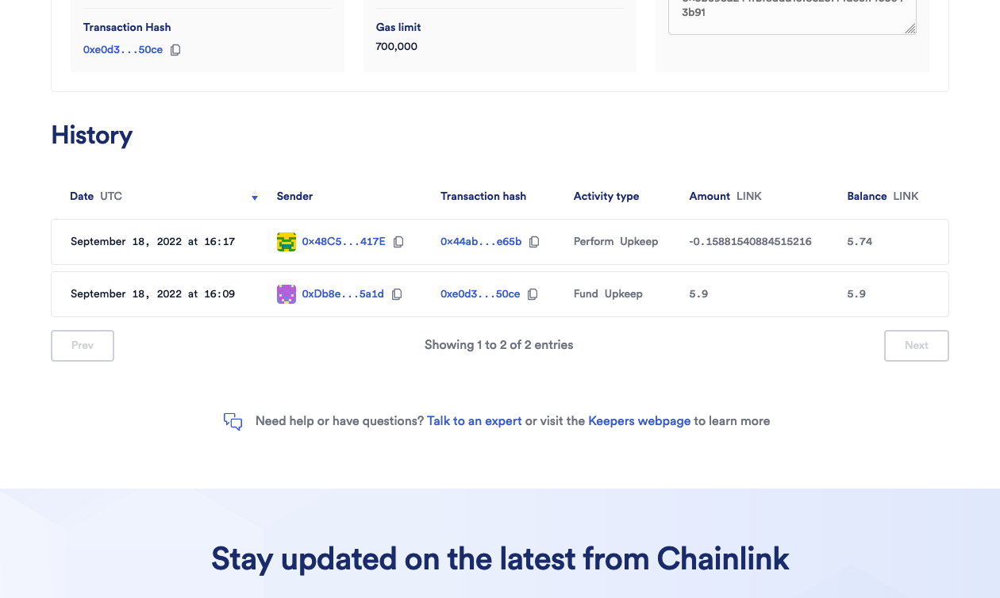<figcaption>
If you go to https://keepers.chain.link/, you will see "Perform Upkeep" in History.
</figcaption></figure>

<figure>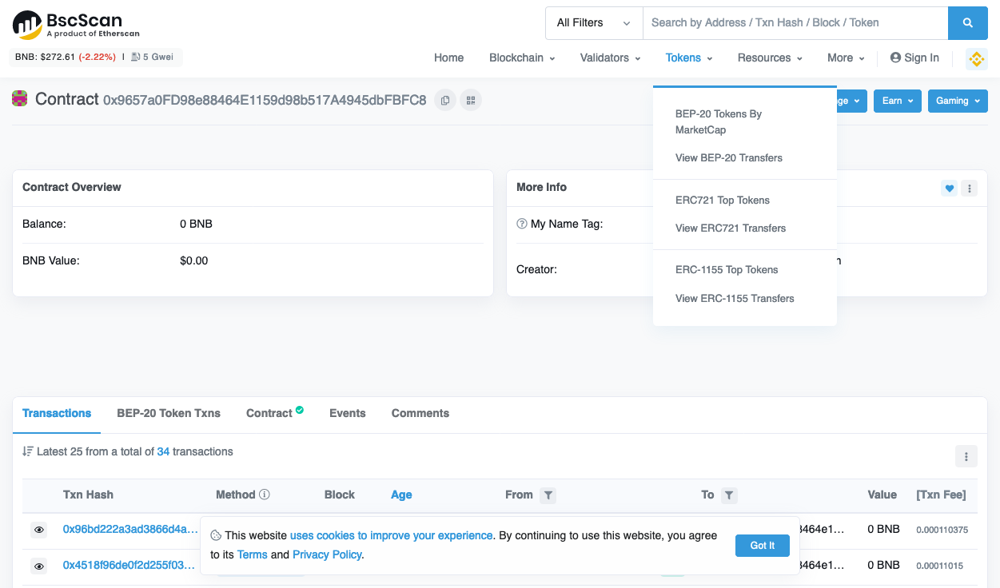<figcaption>
If you go to <a href="https://bscscan.com/address/0x9657a0FD98e88464E1159d98b517A4945dbFBFC8">https://bscscan.com/address/0x9657a0FD98e88464E1159d98b517A4945dbFBFC8</a>, you should also be able to see your automated transaction.
</figcaption></figure>

For reference, the automated Keepers transaction cost $1.22 ($0.95 + 30% premium). The 30% premium on BNB Chain is lower than on any of the other chains (can compare here: [https://docs.chain.link/docs/chainlink-keepers/supported-networks/](https://docs.chain.link/docs/chainlink-keepers/supported-networks/))

The above Keepers transaction can also be found here: [https://keepers.chain.link/bsc/61895360697707478624580988307616544952190176251316156526569833881526378957381](https://keepers.chain.link/bsc/61895360697707478624580988307616544952190176251316156526569833881526378957381)

### Optional Step 5. Canceling Keepers

The final step is for canceling Keepers. Canceling Keepers consists of two parts:

1. Cancel Upkeep
2. Withdraw Funds

We can start this step by going back to [https://keepers.chain.link/](https://keepers.chain.link/). Make sure your wallet is connected.

<figure>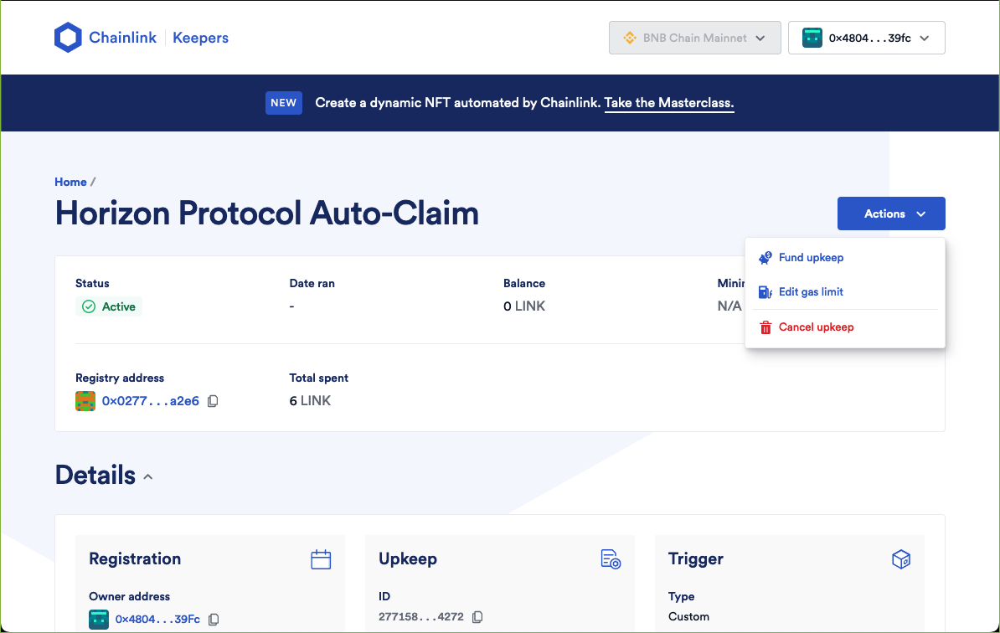<figcaption>
Click on "Actions", and then "Cancel upkeep".
</figcaption></figure>

<figure>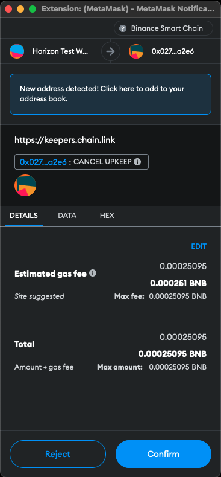<figcaption>
MetaMask prompt for confirmation.
</figcaption></figure>

<figure>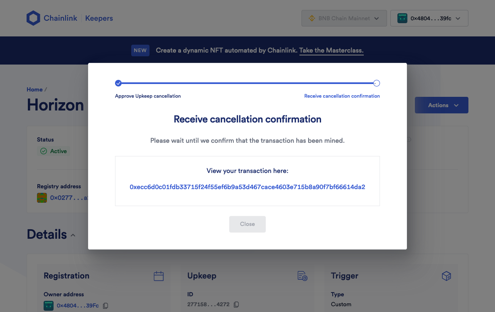<figcaption>
Waiting for final confirmation.
</figcaption></figure>

<figure>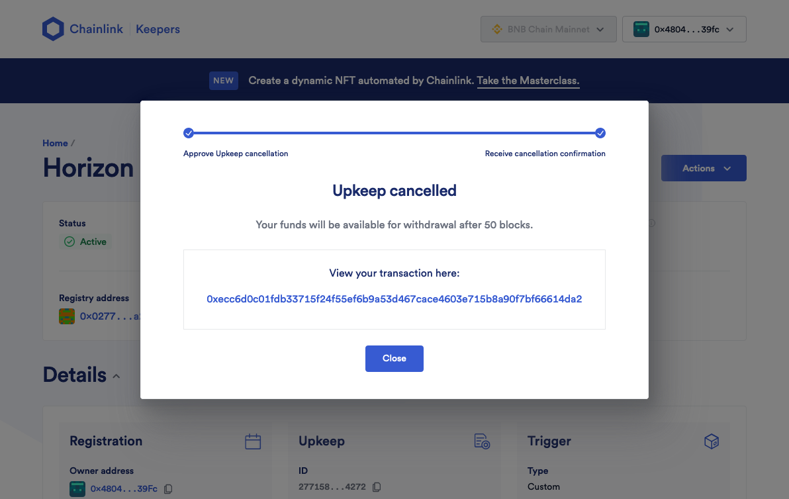<figcaption>
Transaction confirmation that upkeep is cancelled.
</figcaption></figure>

<figure>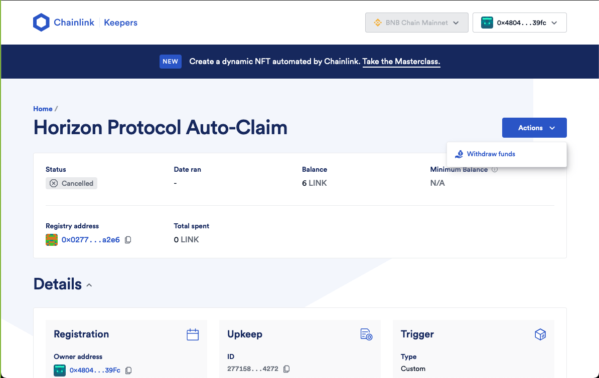<figcaption>
Your "Status" should now say "Cancelled". Click on "Actions" to "Withdraw funds".
</figcaption></figure>

<figure>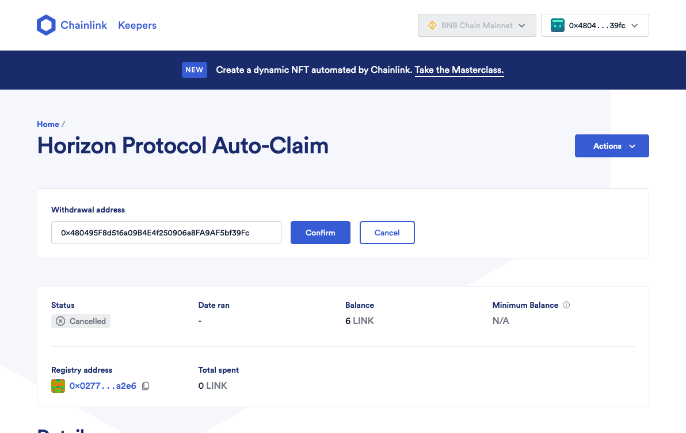<figcaption>
Confirm the "Withdrawal address" is your wallet. Click Confirm.
</figcaption></figure>

<figure>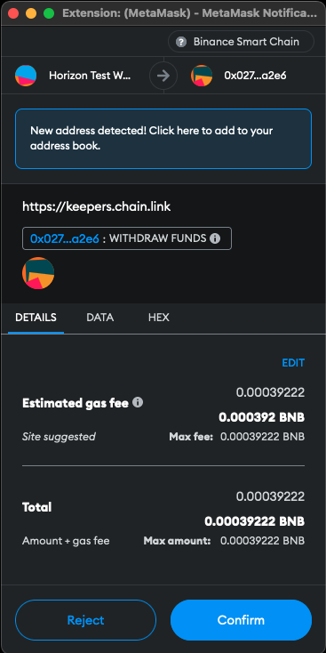<figcaption>
MetaMask confirmation screen.
</figcaption></figure>

<figure>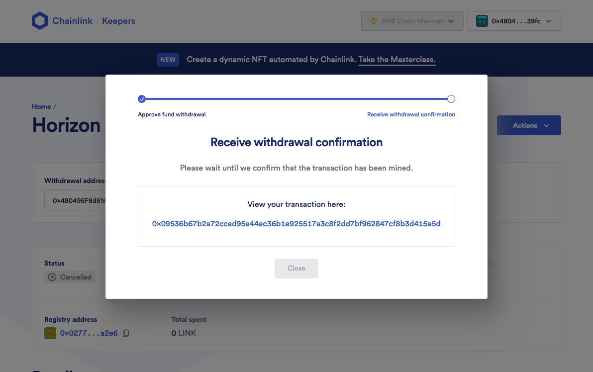<figcaption>
Waiting for transaction confirmation.
</figcaption></figure>

<figure><figcaption>
Funds withdrawn.
</figcaption></figure>

The process for Cancel Upkeep and Withdraw Funds will lose you a bit of LINK (in this case, we went from 6 --> 5.9).

If you check your wallet, you should see your LINK there. Note that this is still the Wrapped LINK ERC677 token. You will need to go to Step 2. and perform a reverse swap to get back LINK BEP-20 tokens.
