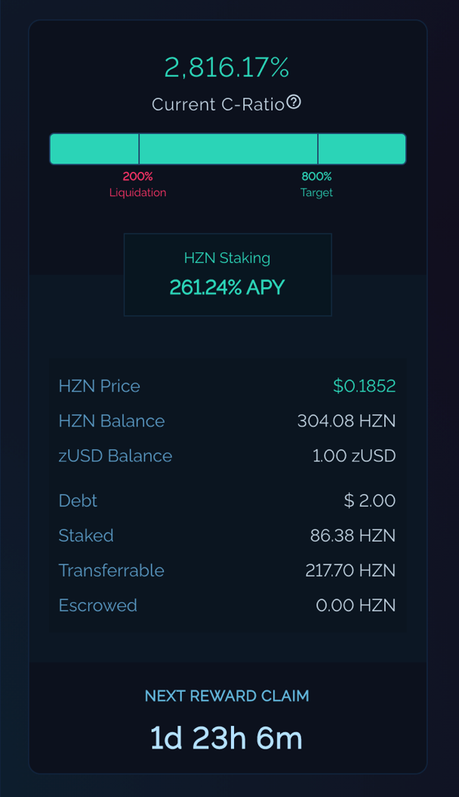

# Interfaces



## Wallet Status

The Wallet status can be seen on the Mint, Burn, and Claim pages.

* **Current C-Ratio**\
  If the user has staked, their current C-Ratio is based on the following formula:\
  **HZN Balance \* HZN Price / Debt**
* **HZN Staking APY**\
  Current APY for staking.
* **HZN Price**\
  The current price of HZN on the market.
* **HZN Balance**\
  The total amount of HZN in wallet (Staked + Transferrable + Escrowed).
* **zUSD Balance**\
  The amount of zUSD held in wallet.
* **Debt**\
  The amount of debt held (currently equivalent to the amount of zUSD minted).
* **Staked**\
  The amount of HZN that is staked to maintain the user's current debt. Staked HZN, while still shows up in your wallet balance, cannot be transferred or utilized. The amount of staked HZN is dynamic and will fluctuate based on the current price of HZN and the amount of debt the user possesses. If you have some transferable or escrowed HZN in your wallet (see below), Horizon Genesis will automatically migrate some of this HZN to become staked in the event of a price drop in order to always maintain an 700% staked-to-debt ratio. Horizon Genesis only ever requires 700% collateralization for the debt that you have, so any HZN that isn't needed (i.e. if the price moves up) to be staked will be released back to the user as transferable or escrowed HZN automatically.
* **Transferrable**\
  The amount of HZN that is not currently staked to back your debt, but is available to be staked. transferable HZN is also available to be transferred to other wallets or sold on the market. Having some transferable HZN means you are above 700% C-Ratio and can act as a buffer for Horizon Genesis to stake with if the HZN price drops.
* **Escrowed**\
  The amount of unstaked HZN locked in escrow. HZN rewards claimed each week are locked in escrow for 1 year from the moment they are claimed. Escrowed HZN cannot be transferred or sold on the market, but can still be utilized to manage your C-Ratio by staking and minting more zUSD. When unstaking your HZN, escrowed HZN will be the first to unstake (and returned to your escrowed balance), followed by transferrable HZN.
* **Next Reward Claim**\
  The time until the next reward (and if you haven't claimed yet this week, the time until your claim this week expires).

## Mint 

Mint zUSD by staking your HZN. This gives you a Collateralization Ratio (C-Ratio) and a debt, allowing you to earn weekly staking rewards.

* **Preset Strategies**\
  One click to select how much to mint; either 1100%, 900%, or 700% C-Ratio.
* **STAKE HZN**\
  Select the amount of HZN to be staked (will display and update relative to MINT zUSD).
* **MINT zUSD**\
  Select the amount of zUSD to be minted (will display and update relative to STAKE HZN).
* **C-Ratio**\
  The current C-Ratio (and the C-Ratio after minting).
* **Debt**\
  The amount of debt the user currently has (and the amount of debt the user has after minting).
* **Staked**\
  The amount of HZN that is currently staked (and the amount of HZN staked after minting).
* **Transferrable**\
  The amount of HZN that is currently not staked (and the amount of HZN not staked after minting).
* **MINT NOW (button)**\
  Click to Mint according to the STAKE HZN <-> MINT zUSD details.

## Burn

Burn zUSD to unlock your staked HZN. This increases your Collateralization Ratio and reduces your debt, allowing you to transfer your non-escrowed HZN.

The user does not lose any HZN when burning. Burning zUSD while under 700% C-Ratio will just reduce the amount of debt the user has without unstaking any HZN, but burning zUSD if the user is above 700% will unstake HZN at a 7:1 proportional rate (in USD terms) to how much zUSD the user burns.

There is a 24 hour 'Burn Lock' after a user mints zUSD, where the user cannot burn any zUSD. This is to prevent oracle front-running attacks on the network.

* **Preset Strategies**\
  One click to select how much to burn; either 1100%, 900%, or 700% C-Ratio.
* **BURN zUSD**\
  Select the amount of zUSD to be burned (will display and update relative to UNSTAKE HZN).
* **UNSTAKE HZN**\
  Select the amount of HZN to unstake (will display and update relative to BURN zUSD). HZN is only unstaked when going above 700% C-Ratio.
* **C-Ratio**\
  The current C-Ratio (and the C-Ratio after burning).
* **Debt**\
  The amount of debt the user currently has (and the amount of debt the user has after burning).
* **Staked**\
  The amount of HZN that is currently staked (and the amount of HZN staked after burning).
* **Transferrable**\
  The amount of HZN that is currently not staked (and the amount of HZN not staked after burning).
* **BURN NOW (button)**\
  Click to Burn according to the BURN zUSD <-> UNSTAKE HZN details.

## Claim

Claim rewards from staking HZN and minting zUSD. Claimed rewards are vested for 12 months from the claim date, but can be used to manage the current C-Ratio or staked again to compound rewards during that time.

* **Staking Rewards**\
  Rewards available to be claimed via staking.
* **Exchange Rewards**\
  Rewards available to be claimed via the Exchange (not available yet).
* **Next Reward Claim Period**\
  Time until next reward is available.
* **Claim Period Ends**\
  Time until this reward expires and cannot be claimed anymore.
* **Total Rewards**\
  Total rewards available to be claimed (Staking + Exchange Rewards).
* **CLAIM NOW (button)**\
  Click to claim weekly rewards.

## Earn

Multiple liquidity pools where you can stake something other than HZN to earn additional HZN.

* **STAKE HZN-BNB LP**\
  Stake HZN-BNB LP (provide liquidity on PancakeSwap) to earn HZN.
* **STAKE ZUSD-BUSD LP**\
  Stake ZUSD-BUSD LP (provide liquidity on PancakeSwap) to earn HZN.

Learn more about Liquidity Pools [here](../staking-on-horizon-genesis/earn-liquidity-pools.md).

## Debt Tracker

Allows users to track their total debt created via collateralizing their HZN.

* **Active Debt**\
  Current amount of debt held, taking into account the fluctuations of Global Debt.
* **Issued Debt**\
  Amount of debt at point of issuance (when last minted) without taking into account the fluctuations of Global Debt.
* **Global Debt**\
  Time until next reward is available.
* **Debt over Time**\
  A time-series graph that shows how debt changed over time. The left vertical axis shows Active/Issued Debt and the right vertical axis shows Global Debt.
* **Global Portfolio**\
  Shows the distribution of where the Global Debt is allocated.
* **Your Portfolio**\
  Shows your total zAsset value and its distribution.

## Escrow

Allows users to be able to keep track of how much of their HZN rewards are still in escrow.

* **Available HZN**\
  Current amount of HZN that can be unlocked from escrow.
* **UNLOCK (button)**\
  Click to unlock your escrowed HZN. This requires an action on the BNB Chain and will cost a bit of BNB.
* **Total Escrowed**\
  Total amount of HZN currently in escrow. To see when they will unlock, check the table below.
* **Total Unlocked**\
  Total amount of HZN that has already been unlocked previously from escrow.

## History

Allows users to keep track of all transactions they have made on Horizon.

* **Type**\
  There are three types of transactions: Mint, Burn, and Claim.
* **Date (UTC)**\
  When the transaction occurred. Time is in UTC.
* **Amount**\
  Amount of HZN or zUSD in the transaction.
* **Tx**\
  A link to the transaction on BSCScan.
