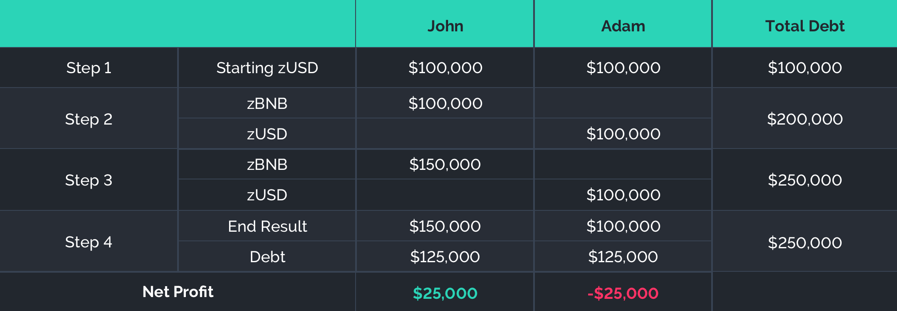

# Collaterialization and C-Ratio

All zAssets produced on Horizon Protocol must be collateralized by HZN in order for their values to be maintained.

In Horizon Genesis, HZN is staked and zUSD is minted at a Collateralization Ratio (C-Ratio) of 700% ($7 worth of HZN to mint $1 zUSD), and this C-Ratio must be maintained in order to collect weekly rewards from the system.

The purpose of the C-Ratio is to ensure that the synthetic assets are sufficiently backed during HZN price fluctuations. The 700% target C-Ratio is subject to change based on the community governance.

## Debt

Debt is an important concept for understanding reward distribution when minting on Horizon Genesis. When a user mints zUSD, they are borrowing zUSD with HZN as collateral, and they will have to return (burn) their zUSD in order to reclaim their HZN. That means that they are now in debt (interest-free) to the amount of the zUSD that they have minted. User rewards are calculated weekly by the ratio of the user's debt relative to the global debt in the Horizon Protocol network.

To help keep track of your debt, Horizon Genesis provides a page to keep track of how much debt you currently hold from staking HZN.

## Managing Debt

Your C-Ratio fluctuates based on 2 things:

* The price changes of HZN
* The price change of any of the synthetic assets that users trade on Horizon Exchange

The total value of all synthetic assets owned by users is what constitutes the global debt pool and is denominated in zUSD. The global debt will increase if traders are profitable (i.e. synthetic asset values increase) and decrease if they are unprofitable (i.e. synthetic asset values decrease).

When Horizon Genesis was first introduced and before Horizon Exchange went live, the only available zAsset was zUSD. Therefore, the only fluctuating variable everyone faced was the price movement of HZN. For example, I mint $100 of zUSD with $700 of HZN at a 700% collateralization ratio. The price of HZN drops by 50% - my C-Ratio is now at 350%. I have to burn $50 of zUSD in order to repay my debt to the system (Or stake an extra $350 HZN) and I can withdraw my initial HZN stake, which is now down 50% due to price change. There is no extra loss I face at this point in time.

Once Horizon Exchange went live, it is possible to hold other zAssets that fluctuate in value. Therefore, users need to consider the total value of all their zAssets. If the user's total zAsset value goes up, their C-Ratio will go up. If the user's total zAsset value goes down, their C-Ratio will also go down.

## C-Ratio and Debt

With Horizon Exchange, where a range of zAssets are introduced into Horizon Protocol, you will need to understand that your debt obligation to the system is proportionally based, meaning the system tracks the percentage of your debt relative to the global debt. Because of this, when the prices of the assets in the global debt portfolio change, so does your debt obligation. If you are 1% of the global debt with $1000 in debt, and the average price of all assets in the global portfolio increases by 10% (which also means the global debt is increased by 10%), then your debt obligation will also increase and become $1100. If the synthetic assets you hold do not also increase by 10%, then you will incur a loss (assuming the global debt doesn't shrink back later).

Lets take an example:

Scenario:

1. John and Adam both mint $100k zUSD. The total network debt is $200k, with John and Adam responsible for 50%.
2. John buys zBNB with his $100k and Adam holds zUSD.
3. In this example, BNB increases by 50% increasing John's holdings to $150k. This price fluctuation increases the total debt to $250k.
4. John and Adam are still responsible for 50% of the total debt each. This means John and Adam both owe $125k. When John's zBNB is taken into consideration, he has profited $25k. Even though Adam still has the same zUSD position size of $100k - the debt he owes increased by 25% resulting in a $25k loss.

To mitigate this risk, you can either try to mirror the global portfolio, or you can hedge your position by holding some inverse assets (synthetic assets that directly short the market) to offset the volatility in both directions (long and short).

It is fundamental to understand that when other zAssets join zUSD in the synthetic asset lineup that if you were to merely stake HZN as collateral and just hold your minted zUSD, you are effectively shorting the global portfolio if that portfolio consisted of appreciating synthetic assets.

## Liquidation 

This section was moved to the following page: [Liquidation](liquidation.md).

## Managing C-Ratio and Rewards Summary

* Users must maintain a C-Ratio of above 700% in order to be eligible for rewards. (If you are within a few percent of 700%, i.e. 695% or above, you’ll be able to claim.) If not, you'll have to buy more HZN or burn zUSD to restore your C-Ratio. The Target C-Ratio (700%) is subject to change based on community governance decisions.
* Rewards are calculated and made available once per week on Fridays.
* Use the [Horizon Genesis Website](https://genesis.horizonprotocol.com/) to navigate to the Claim section.
* Press Claim Now to collect both your zUSD and HZN weekly rewards.
* Rewards will be available to be claimed for 7 days. Unclaimed rewards will be forfeited.
* Claimed HZN rewards are escrowed for 1 year. You won't be able to transfer or sell them. You’ll be able to re-stake them or use them to manage your C-Ratio, however.
* Users will be at risk of liquidation if their C-Ratio goes below 200%.

The following page allows users to keep track of how much HZN rewards are currently in escrow.

