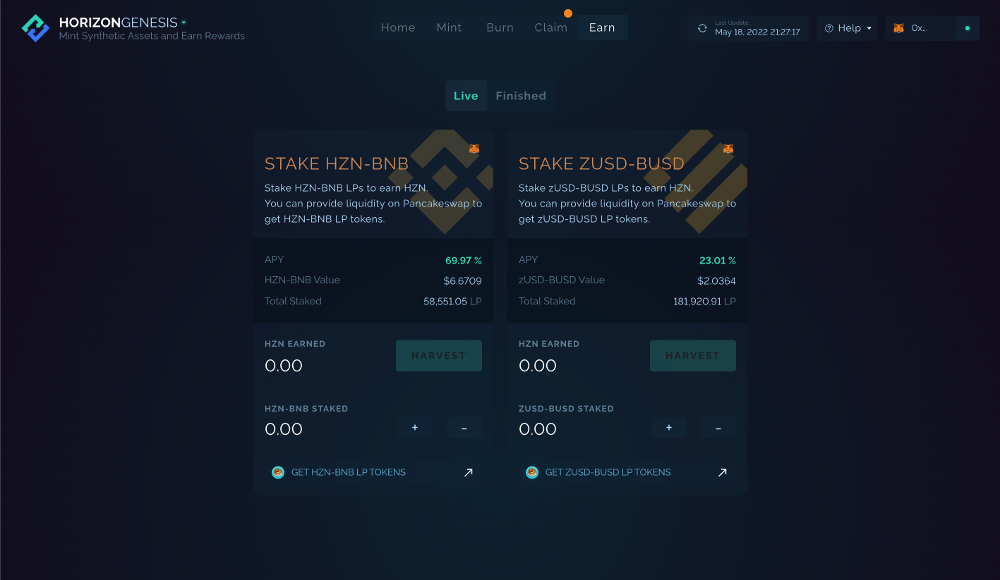

# Earn: Liquidity Pools

**Horizon Genesis also provides additional opportunities to Earn through liquidity provision and the staking of LP tokens.**

All rewards are supplied by Horizon Protocol's monetary policy outlined [here](../../horizon-protocol/introduction/tokenomics.md) with exception to emissions from the initial token distribution. All rewards are subject to change based on project/market progression and community governance.

## HZN-BNB Pool 

**Purpose**: To facilitate a decentralized on-ramp for the HZN token via PancakeSwap, so users can buy and sell HZN on the open market.

**Staked Token**: [HZN-BNB LP](https://bscscan.com/token/0xdc9a574b9b341d4a98ce29005b614e1e27430e74)

**Rewards**: `144,230 HZN` per week

**Duration**: April 16th, 2021 - Ongoing

**Pool**: [PancakeSwap HZN-BNB LP](https://pancakeswap.finance/add/BNB/0xc0eff7749b125444953ef89682201fb8c6a917cd)

**Smart Contract**: `0x84838d0AB37857fAd5979Fcf6BDDf8ddb1cC1dA8`

## zUSD-BUSD Stablecoin Pool 

**Purpose**: To facilitate a decentralized on-ramp for the zUSD token via PancakeSwap, so users can buy and sell zUSD on the open market.

**Staked Token**: [zUSD-BUSD LP](https://bscscan.com/token/0xc3bf4e0ea6b76c8edd838e14be2116c862c88bdf)

**Rewards**: `45,000 HZN` per week

**Duration**: July 30th, 2021 - Ongoing

**Pool**: [PancakeSwap zUSD-BUSD LP](https://pancakeswap.finance/add/0xe9e7CEA3DedcA5984780Bafc599bD69ADd087D56/0xF0186490B18CB74619816CfC7FeB51cdbe4ae7b9)

**Smart Contract**: `0x5646aA2F9408C7c2eE1dC7db813C8B687A959a85`

## PHB Pool (Ended) 

**Purpose**: To emit the initial fair launch token distribution as outlined [here](https://horizonprotocol.medium.com/horizon-protocol-hzn-staking-details-4858648f8128). These rewards come from the initial token distribution and not from the Horizon Protocol monetary policy.

**Staked Token**: [PHB](https://bscscan.com/token/0xdff88a0a43271344b760b58a35076bf05524195c)

**Rewards**: `113636.3636 HZN` per week

**Duration**: April 16th, 2021 - April 15th, 2022

**Smart Contract**: `0xD4552F3e19B91BeD5EF2c76a67ABdbFfeD5caEEC`

## Rewards Timeline

| Pool                           | Ends on                                                                      |
| ------------------------------ | ---------------------------------------------------------------------------- |
| Staking HZN in Horizon Genesis | Indefinite                                                                   |
| HZN/BNB LP pool                | Ongoing                                                                      |
| zUSD/BUSD LP pool              | Ongoing                                                                      |
| PHB Pool                       | Ended on April 15th, 2022.                                                   |
| HZN Pool on Horizon Staker     | Ended on July 23rd, 2021 and transitioned to Staking HZN in Horizon Genesis. |

\
