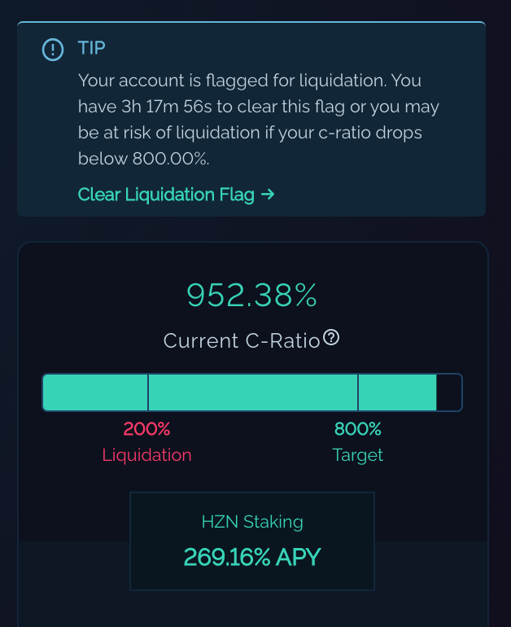

# Liquidation

Liquidation is a critical function to the health of the collateralization of synthetic assets on Horizon Protocol. Liquidation ensures that there will still be sufficient collateral to back synthetic assets in the event of a serious price drop (-90%) in HZN. It creates an incentive for stakers to maintain a healthy C-Ratio as well an incentive for liquidators to liquidate these accounts for a profit. This 2-sided approach ensures that the global network C-Ratio is maintained at a healthy level.

Once a user is flagged for liquidation and they don't restore their C-ratio and clear the flag, they will appear on a list of accounts available to be liquidated (will be viewable on the [network stats page](https://dashboard.horizonprotocol.com/) soon along with the amount of zUSD needed to cover their position back to an 800% C-Ratio). From here, a liquidator with sufficient zUSD can liquidate these accounts and claim back HZN with a 10% bonus.&#x20;

## Sample Liquidation Scenario

Let's take an example:

Consider the following conditions:

* Target C-Ratio: 800%
* Liquidation C-ratio: 200%
* Liquidation penalty: 10%
* Liquidation delay: 3 days
* HZN (starting) value: $1 USD

For example:

1. John has 400 HZN staked. At HZN value of $1 USD, this is worth $400 USD. When he initially minted at a C-Ratio of 800%, he received $50 zUSD. Because he has not been actively checking due to a price drop of HZN to $0.25 USD, the total value of staked HZN is now $100 USD, his C-Ratio has gone from 800% to 200%, which means he currently has a C-Ratio of 200% while still holding $50 zUSD of debt minted. 200% is the Liquidation C-ratio, which means, John's liquidation flag has been activated.
2. If John fails to restore his C-Ratio back to 800% within 3 days, his account becomes available to be liquidated. To get back to 800%, without investing more HZN, John needs to lower his debt to $12.5 zUSD, which means $37.5 zUSD needs to be burned by John.
3. If John fails to restore his C-Ratio back to 800% during the 3 day grace period, the liquidator, Adam, now has the opportunity to liquidate John by helping him get back to 800% C-Ratio. The liquidation calculation is slightly different from the calculation John would need to get back to 800% C-Ratio. To calculate how much zUSD is required to restore John's C-Ratio to 800% via liquidation, this formula is used: \
   `Z = (t * D - V) / (t - (1 + P)`

```
Z = zUSD debt required to restore John's C-Ratio
t = target C-Ratio (i.e. 800%, or 8)
D = debt balance (i.e. $50 zUSD)
V = value of staked HZN in zUSD (i.e. $100 USD)
P = liquidation penalty (i.e. 10%, or 0.1)

(8 * 50 - 100) / (8 - (1 + 0.1)) = 43.478260869565217 zUSD.
```

4\. Adam, as the liquidator, can now burn $43.478260869565217 zUSD from his own wallet to restore John's C-Ratio to 800% and he will receive a 10% reward for his efforts in the form of HZN. The amount of HZN Adam receives is based on this formula: `R = (Z * (1 + P)`

```
R = HZN liquidation reward
Z = zUSD debt required to restore John's C-Ratio (i.e. 43.478260869565217)
P = liquidation penalty (i.e. 0.1)

(43.478260869565217 * (1 + 0.1)) = 47.826086956521739 USD worth of HZN
```

5\. Therefore, this results in `$47.826086956521739 USD` worth of HZN going from John's staked HZN into Adam's wallet. At $0.25 USD per HZN, this adds up to `191.3043478261 HZN` of John's going to Adam, leaving `208.6956521739 HZN` still staked with John. The liquidation reduces John's debt by `$43.478260869565217 zUSD`, leaving him with `$6.521739130434783 zUSD` in debt and a C-Ratio of 800%.

In summary, Adam, as the liquidator, can help John get back to 800% C-Ratio by burning his own zUSD. In return for burning is own zUSD, Adam gets rewarded at 110% of what he burned in zUSD in the form of HZN, which comes out of John's HZN stake.&#x20;

To summarize further, the liquidator, Adam, basically makes a free 10% profit when liquidating someone by paying out in zUSD and getting that amount + 10% back in HZN.

## Clearing the Liquidation Flag

If the user restores their C-Ratio back to 800% within the 3-day grace period, the user may then clear their liquidation flag.&#x20;

**It is very, very important to note that this is a manual function** that requires the user to update the smart contract that they are no longer flagged, otherwise other users will still have the ability to liquidate this user after the 3-day grace period anytime the C-Ratio are below 800%. This smart contract update requires a transaction on the blockchain and the user will need to pay the gas fee.&#x20;

The Horizon Genesis UI will indicate to the user in regards to this status and instruct the user on how to clear the liquidation flag.



## Guide on how to Liquidate

Liquidation is a very important aspect of protecting the protocol. Although there is currently no official interface for this, Horizon Protocol believes it is important for the method to be shared.&#x20;

Below is a step-by-step guide for how to liquidate:

1. **Check who can be liquidated**\
   To check, go to the Liquidation section in the [Horizon Dashboard](https://dashboard.horizonprotocol.com/). Click into "Open for Liquidation".\
   \
   The "Liquidation Amount" is the number of USD that can be liquidated at this time. The "Liquidatable HZN" is the amount of HZN that makes up the "Liquidation Amount". If you liquidate, you will burn the "Liquidation Amount" in the form of zUSD and then get back the amount of HZN shown in "Liquidatable HZN" + an extra 10% on top.\
   **Note**: Locked/Escrowed HZN tokens are not liquidatable.
2. **Go to the contracts on BSCScan**\
   Navigate to BSCScanat this web address: [https://bscscan.com/address/0x9EF25320Ce7824F78387a07733B85C1FB6218D13#writeContract](https://bscscan.com/address/0x9EF25320Ce7824F78387a07733B85C1FB6218D13#writeContract). This webpage has the relevant contract that is needs to be implemented for liquidation.
3. **Connect your wallet to BSCScan**\
   Look for this link: “Connect to Web3”. \
   \
   Once connected, should say: Connected - Web3 \[wallet address], with a green dot. (Double check in your wallet that it says "Connected" as well.)
4. **Find the Liquidation Contract**\
   Scroll down to "22. liquidateDelinquentAccount". Under ‘account (address)’, copy in the address you are trying to liquidate (found in step 1 from Horizon Dashboard). In zUSDAmount (uint256), type the amount in USD with 18 0s after. i.e. $1 zUSD = 1000000000000000000. The screenshot has 20 0s, so it represents $100 zUSD.\
   
5.  **Write the Contract**\
    This step will involve BNB Fees. Once you click write, your wallet should open up to confirm.

    Note that errors occur when the account you are liquidating does not have have enough HZN to be liquidated or they aren't up for liquidation yet. If you see an incorrect fee or error message (i.e. 0.4 BNB is incorrect. Should be closer to 0.004 BNB), then there is not enough to be liquidated.\
    Below is an image of an error message from MetaMask:\
    
6. **Check how much HZN you received**\
   To see exactly how much you got, you can check by going to BSCScan.com and adding your BNB Chain wallet address. The latest transaction should show the amount of HZN you received.
7. **(Optional) Trade HZN for zUSD**\
   If you want to get zUSD back, you can sell the HZN that you just received back into zUSD on [PancakeSwap](https://pancakeswap.finance/swap).

One thing to note is that HZN added to a wallet that is staking HZN is that when you are below Target C-ratio, the HZN will automatically be used in an attempt to balance the C-ratio, therefore, it cannot be traded for zUSD. If you want to trade for zUSD, then you might need to use a separate wallet if your staked wallet is under Target C-ratio.
