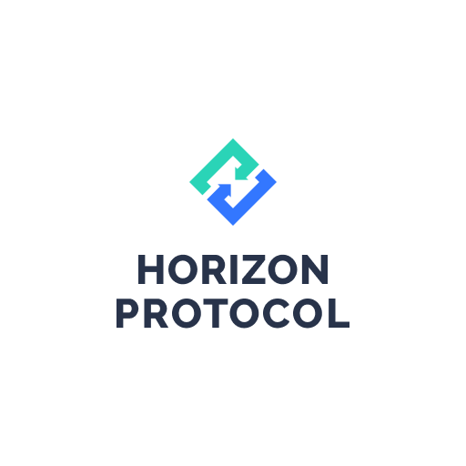

# Brand Assets


This version of Horizon Academy has been deprecated! To find the latest version, please visit: [English V2](https://academy.horizonprotocol.com/)



Please do not edit, change, distort, recolor, or reconfigure the logo.


## Horizontal

<figure><figcaption></figcaption></figure>

 

<figure><figcaption></figcaption></figure>

 

<figure><figcaption></figcaption></figure>

 

<figure><figcaption></figcaption></figure>

## Vertical

<figure><figcaption></figcaption></figure>

 

<figure><figcaption></figcaption></figure>

 

<figure><figcaption></figcaption></figure>

 

<figure><figcaption></figcaption></figure>

## Others

<figure><figcaption></figcaption></figure>

 

<figure><figcaption></figcaption></figure>

 

<figure><figcaption></figcaption></figure>

 

<figure><figcaption></figcaption></figure>

 

<figure><figcaption></figcaption></figure>

 

<figure><figcaption></figcaption></figure>

 

<figure><figcaption></figcaption></figure>

## Colors

Primary-blue and primary green are both primary colors dark-grey is text color used in Logotype.

### Primary colors

<figure><figcaption></figcaption></figure>

### Accent colors

<figure><figcaption></figcaption></figure>

<figure><figcaption></figcaption></figure>

