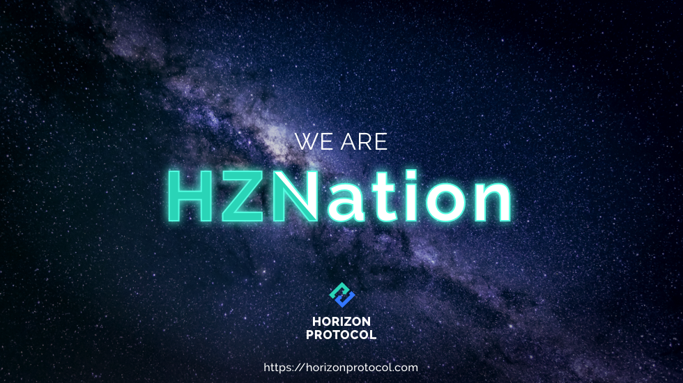

# Community Driven

Horizon Protocol is a community-driven project that is governed by a DAO (decentralized autonomous organization), where protocol-level decisions, such as which synthetic assets should be created, or what new types of collateral can be used to increase the liquidity of zAssets, will be managed and voted on by the community.

Horizon Protocol’s vision is to provide the community with a robust suite of tools to invest and trade with in a secure, trustless, and borderless way, reducing the barriers to entry and providing accessibility by offering a wider range of synthetic assets to the crypto space.

Learn more about our efforts in building our community via [Telegram](https://t.me/HorizonProtocol) or [Discord](https://discord.gg/SaDKvkbQF2).

<figure><figcaption></figcaption></figure>
