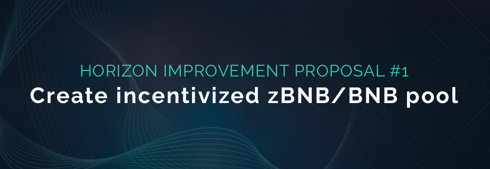

# HIP-1: Create incentivized zBNB/BNB pool

**Type:** Horizon Improvement Proposal\
**Date:** May 12th, 2022\
**Status:** Draft 2

## Summary

Deploy a zBNB/BNB Ellipsis LPs to provide a secondary on-ramp for users to get zAssets for Horizon Exchange and allow for greater arbitrage opportunities, which could help strengthen the zUSD peg. Ease of access to Horizon Exchange is key to the success of the platform.

## Specification

* Deploy a zBNB/BNB LP on [Ellipsis](https://ellipsis.finance/pool).&#x20;
* Deploy the zBNB/BNB LP as a new staking pool in Horizon Genesis (in the Earn tab).
* Allocate 30,000 HZN from the weekly rewards generated by the HZN inflation policy to the zBNB/BNB LP pool on Ellipsis to incentivize the staking.

## Motivation

The goal of this proposal is to provide a secondary on-ramp for users to get into zAssets from the open market. This will make the Horizon Protocol ecosystem more accessible. The secondary onramp will also make it easier to trade and arbitrage zAssets on the open market (i.e. zUSD/BUSD on PancakeSwap).

### Why BNB?

BNB is the native coin on our home chain, making it a low risk asset relative to the ecosystem we exist in. BNB is also the most liquid asset on the BNB Chain and it has no risks associated with being bridged from another chain, unlike many of the tokens of the BNB Chain.

### Why Ellipsis?

Ellipsis Finance is a stablecoin AMM DEX that allows for lower slippage and lower fees when trading stablecoins since they focus on liquidity pools of similarly behaving assets (i.e. zBNB/BNB, a pair that always has equivalent value, like stablecoins).

* Their LPs can also be multi-collateral, making it easier to maintain pegs.
* Ellipsis swap fees can be as low as 0.04%, making it easier to arbitrage the price closer to the peg.

Deploying a zBNB/BNB pool on Ellipsis will make it cheaper for users to on/off-ramp into zAssets and the peg will be more stable.

### Why 30,000 HZN?

Currently, the incentive for the zUSD/BUSD pool is 45,000 HZN/week (\~$2,700 with HZN at $0.6), which has so far yielded a TVL of \~$435k and a \~33% stablecoin yield (some of the highest in the space, even with HZN being so undervalued). The zBNB/BNB isn’t as crucial to the Horizon Protocol as the zUSD/BUSD liquidity pool is, therefore, a slightly lower reward rate seems valid. The zBNB/BNB pool will have much lower risks compared to pool 2s, making this pool a no-brainer for BNB holders that want to earn yield with low IL (impermanent loss).

### Arbitrage Opportunities

Below are a couple arbitrage opportunities that become more available with two onramps instead of one:

#### **Method 1 - Arbitrage to Profit**

This method describes an arbitrage opportunity where you get in and out without holding zAssets long term. It involves buying one zAsset from one pool at a discount and then selling in another pool for full price.

**For example:**

1. zUSD is currently at exactly $1.00 in the zUSD/BUSD pool and zBNB is priced at 0.95 BNB due to imbalances in the pool. If you buy zBNB with BNB, you are paying only 0.95 BNB for 1 zBNB.
2. Once you have the zBNB, you can trade it for zUSD in Horizon Exchange.
3. Once you have the zUSD, you can take it to PancakeSwap and sell it for $1.00

**The resulting profit should be 4.46%:**

* Profit of 5% when trading BNB for zBNB
* 0.04% Ellipsis fee when trading BNB for zBNB
* 0.25% Horizon Exchange fee when converting zBNB to zUSD
* 0.25% PancakeSwap fee when converting zUSD to BUSD.

A similarly reversed arbitrage opportunity would exist if zUSD was under-pegged.

#### **Method 2 - Arbitrage to Increase Exposure**

This method describes an arbitrage opportunity where you take advantage of the price discrepancy to buy zAssets at a discount.

**For example:**

1. You have 0.01 BTC. You are interested in having zBTC.&#x20;
2. zUSD is currently below its peg and priced at $0.935 USD. Because zUSD are below their 1:1 peg, you can buy them at a discount (this can be any openly traded zAsset, so that includes zUSD or zBNB if the liquidity pool gets created).&#x20;
3. Once you have zUSD or zBNB, you can then exchange it for zBTC on the Horizon Exchange.

**The resulting profit should be 5.75%:**

1. Profit of 6.5% when trading BUSD for zUSD (at $0.935 USD)
2. 0.5% PancakeSwap fee when converting BTC to zUSD (BTC > BUSD > ZUSD)
3. 0.25% Horizon Exchange fee when converting zUSD to zBTC.

#### **Method 3 - Horizon Genesis Arbitrage**

This method describes an arbitrage opportunity where you purchase zAssets on the open market for a lower price.\
\
The use case is that if you are currently staking HZN on Horizon Genesis and are holding a position that is below the target C-Ratio, buying zUSD or zBNB on the open market could be a profitable if zUSD or zBNB is below its 1:1 peg, which would make burning zUSD and fixing your C-Ratio cheaper since Horizon Genesis always values zUSD at $1.00.

If zUSD or zBNB are over its 1:1 peg, selling your minted zUSD (or converting zUSD to zBNB on Horizon Exchange and selling it) would be profitable as you could use the profit to buy back into HZN and stake it to mint more zAssets, increasing your staking APY.

#### **Method 4 - zAsset Wrapper Arbitrage (future opportunity)**

This method describes an arbitrage opportunity for a future feature that will be coming to Horizon Exchange. This feature allows for Horizon Protocol to deploy zAsset token wrappers to create a new way of minting zAssets and provide an additional onramp for zAssets.

Wrappers work by taking an existing asset, i.e. BNB, and then wrapping it in a zBNB wrapper. This means that the underlying asset, BNB, is set as collateral, but the zBNB can be traded as zBNB. When you unwrap the zBNB, you get the BNB back.

Wrapped assets will always be valued 1:1 to their corresponding zAsset, similar to how zUSD will always be 1:1 with USD. All wrapped assets will be deposited into a pool that everyone can get access to.

**For example:**

1. zBNB is currently selling at 95% of BNB.
2. You buy the zBNB on the open market.
3. You unwrap the zBNB and you get BNB.

**Assumed resulting profit is TBD:**

* Profit of 5% of zBNB → BNB
* Fees required for buying zBNB
* Fees required for unwrapping zBNB → BNB

#### Arbitrage Conclusion

Because there is no automatic process for balancing zAssets on the open market, we must create incentives to do so. As long as the zUSD or zBNB peg discount is greater than the cumulative exchange fees of the arbitrage opportunity and any slippage, then you will result in profit. Also, it is noteworthy to remind that trades on Horizon Exchange have no slippage, making these arbitrage opportunities even better.

## **Potential Risks**

The implementation of this HIP might come with some risks, including the following:

* There is a slight increase in HZN selling potential due to rewards being distributed to yield farmers.
* Ellipsis has fewer users than PancakeSwap, so it might be slightly more difficult for some people to access.

## Considerations

Additional thoughts we should take into consideration:

* The reward incentives are not set in stone. They can be re-evaluated by the community and changed in the future. There is a balance in deciding rewards, too little or too much can be bad for the protocol and they should be adjusted as the crypto market changes.

## Feedback & Questions

**Only BNB LP? No zUSD/BTC/ETH LPs?**\
****Since this is new development, we should only start with one. As a project on the BNB Chain, it makes the most sense to start with zBNB/BNB LP. We also can’t incentivize LPs for every zAsset; it is not a sustainable use of the token’s monetary policy. We need to be strategic in which tokens we want to incentivize.

**“Where do the rewards come from? zUSD minting pool, BNB/HZN pool or zUSD/BUSD pool?”**\
****zUSD minting pool. Therefore, the zUSD minting pool will be receiving 30,000 HZN less than before.

**Why not on Pancakeswap?**\
****Instead of incentivizing this liquidity pool on PancakeSwap, this proposal is opting to incentivize a pool on Ellipsis Finance, which is a stablecoin DEX fork of Curve Finance that has lower slippage and lower fees than traditional AMMs and a better pegging mechanism due to having potentially more than 2 assets in the pool (3EPS pool for example).&#x20;

**Why is zUSD not able too maintain its 1:1 peg on PancakeSwap?**\
****Currently, the only way to trade zAssets into the open market is via zUSD/BUSD on PancakeSwap. Because this is the only onramp and due to the way that PancakeSwap’s AMM algorithm works, any imbalance to the zUSD/BUSD pool will result in it losing its peg. In other words, if there are more trades going zUSD → BUSD than vice versa, then zUSD’s price will drop and BUSD will get more expensive. Without another way to buy in or out, then we would need to wait for someone to use BUSD to buy zUSD to balance out the peg.

The proposal to introduce the zBNB/BNB pool in Ellipsis allows for another way to onramp to Horizon Exchange and interact with zAssets on the open market. You can now buy BUSD with zUSD, then convert it to zBNB, and then sell it for BNB, allowing this set of actions to be purely about arbitrage.

Maintaining a peg requires arbitrage. This arbitrage could come from organic users, bots, or from a professional market maker. Each time zUSD or zBNB is off peg, it is an opportunity to profit through arbitrage.
