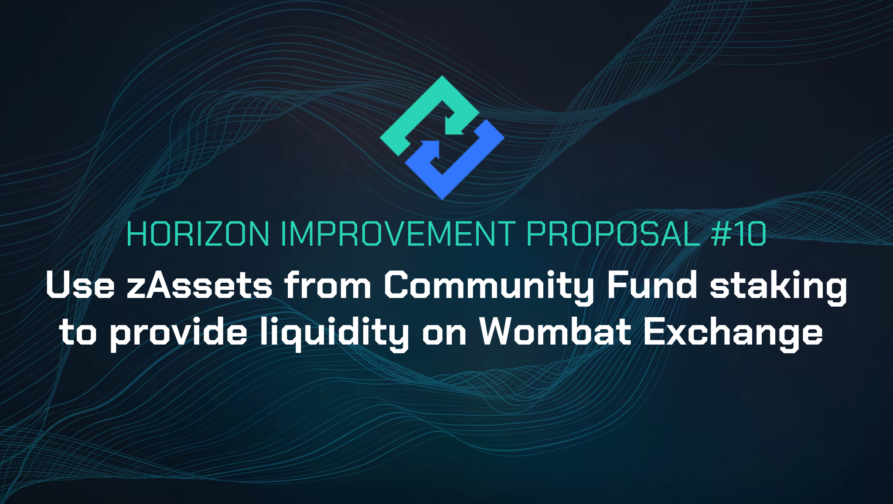

# HIP-10: Use zAssets from Community Fund staking to provide liquidity on Wombat Exchange

**Type:** Horizon Improvement Proposal \
**Date:** Jun 21st, 2023\
**Status:** Draft 1&#x20;

<figure><figcaption></figcaption></figure>

## Summary

Should [HIP-7](hip-7-utilize-the-community-fund-for-additional-liquidity.md) and [HIP-9](hip-9-redirect-hzn-from-earn-pools-to-wombat-exchange-as-bribes.md) pass, the zAsset liquidity provided from the Community Fund staking ([HIP-7](hip-7-utilize-the-community-fund-for-additional-liquidity.md)) will automatically be generating [WOM tokens](https://docs.wombat.exchange/docs/tokenomics/about-wom#what-is-wom). This proposal aims to lay out how the WOM tokens will be utilized.

50% of the earned WOM tokens will be locked as veWOM for a period of 6-months and used to [vote to direct WOM token incentives for Horizon Protocol liquidity pools](https://docs.wombat.exchange/docs/getting-started/gauge-voting). WOM used in this way will also earn a portion of the HZN bribes, which will be redirected back to the community fund.

The HZN that is redirected back to the community fund will reduce the protocol’s overall cost basis for LP incentives while also alleviating the amount of new circulating HZN.&#x20;

The remaining 50% of WOM tokens will be sold on the open market to generate additional revenue and serve the purpose of the community fund, aiding in the sustainable growth of the protocol.

WOM earned from providing liquidity will either be [staked as veWOM to vote for additional rewards towards zUSD-BUSD and zBNB-BNB liquidity pools](https://medium.com/wombat-exchange/wombats-voting-gauge-47c9ee4c8341), or used to generate revenue.\
This strategy will help the protocol earn non-HZN based yield while simultaneously reducing the amount of new [circulating HZN](https://dashboard.horizonprotocol.com/#staking).

## Specification

* Distribute zAsset liquidity to the zUSD-BUSD and zBNB-BNB liquidity pools at a 50/50 ratio as a start
* Earn WOM tokens
* Stake 50% of the WOM tokens to lock as veWOM and vote for Horizon Protocol liquidity pools
* Sell 50% of WOM tokens as revenue to support the community fund and fostering sustainable protocol growth
* Direct all HZN earned from voting back to the community fund

## Motivation

* Increase liquidity on open markets: By better incentivizing liquidity provision, we aim to enhance the liquidity available on various markets, making them more robust and efficient.
* Generate revenue for the protocol: Through this incentivization process, we intend to generate additional non-HZN revenue for the protocol, ensuring its longer term sustainability and growth.
* Guarantee voting to direct incentives to our pool: By voting to allocate WOM incentives to our pools directly, it ensures that the incentives directed are more consistent and reliable.
* Distribute all HZN earned from voting back to the community fund: This reduces the cost basis of LP incentives for the protocol, making it more sustainable in the long run and alleviates the amount of new circulating HZN.

Here is an example: Distribute $1,000 worth of HZN tokens as ["bribes"](https://medium.com/wombat-exchange/so-what-on-earth-are-bribes-bfb3b6521ae) within the Wombat incentive system. At time of writing the ["bribe efficiency"](https://docs.wombat.exchange/docs/getting-started/gauge-voting#bribe-efficiency) stands at 116%. This implies that approximately $1,160 worth of WOM tokens will be distributed to our zAsset pools as rewards for providing liquidity.

Moreover, the initial $1,000 in HZN tokens are also allocated as rewards for individuals holding veWOM who [vote](https://app.wombat.exchange/gauge-voting) for our liquidity pools. This includes both the protocol itself and any zAsset liquidity providers with veWOM. By participating in both, users compound their rewards even higher than what is currently possible with our existing Earn Pools while using the same amount of HZN.

Through this initiative, we aim to increase liquidity, generate revenue, ensure targeted incentives, and further reduce the cost basis of LP incentives by distributing earned HZN tokens back to the community fund.&#x20;

\

## Potential Risks

The implementation of this HIP might come with some risks, including the following:

* If the ‘Bribe Efficiency’ becomes below 100% on a consistent basis then sending the HZN reward distribution to Wombat would not necessarily be a worthwhile endeavor. The community would have to monitor this ratio and the protocol will work with Wombat to ensure it is economical to do so.

## Considerations

Additional thoughts we should take into consideration:Additional thoughts we should take into consideration:

*   Staking the zAssets from the community fund in Wombat might result in reduced WOM token rewards for other liquidity providers, but it is essential to prioritize maximizing liquidity for the overall benefit of the protocol. The primary objective is to ensure ample liquidity, which is crucial for the protocol's success. Additionally, any revenues generated through this process would significantly extend the protocol's runway, enabling it to achieve long-term objectives.

    \

    By leveraging the Wombat incentive system and flowing any HZN earned from accepting our own bribes back to the community fund, we can optimize the use of HZN tokens to incentivize our liquidity pools. This approach improves the tokenomics of the protocol, ensuring that the available resources are utilized effectively and efficiently which enhances the protocol's sustainability and drives its long-term success.

## Feedback & Questions

Please ask your questions here.
