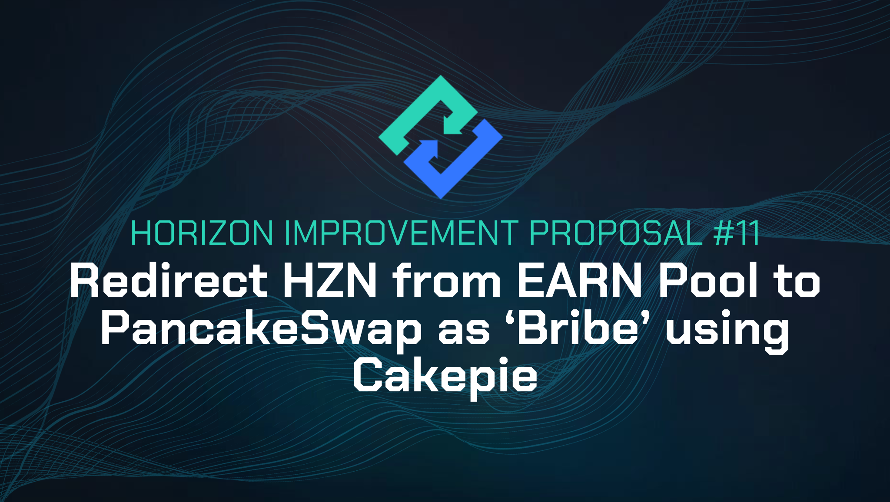

# HIP-11: Redirect HZN from EARN Pool to PancakeSwap as ‘Bribe’ using Cakepie

**Type:** Horizon Improvement Proposal \
**Date:** Jan 3rd, 2024\
**Status:** Draft 2

<figure><figcaption></figcaption></figure>

### Summary

PancakeSwap’s new [Gauges Voting incentive system](https://blog.pancakeswap.finance/articles/introducing-gauges-voting-and-ve-cake-your-ownership-of-cake-emissions) can provide more value than our current earn pools by leveraging veCAKE incentives and Cakepie’s bribe system, with the potential to distribute more incentives than relying solely on our current EARN pool. Improved incentives can encourage a deeper liquidity to our core token HZN.

By redirecting a portion or all of the HZN, typically directed towards Earn, to PancakeSwap bribes via [Cakepie](https://www.pancake.magpiexyz.io/stake), liquidity providers can potentially earn the equivalent or greater in CAKE tokens (we currently offer 144,000 HZN to EARN per week for the HZN-BNB pool). They will also have the ability to earn extra HZN by following Cakepie’s incentive system, which involves locking CAKE and voting.\
\
Additionally to the improved incentives for liquidity providers, this integration can create awareness for the project and potentially attract PancakeSwap’s and Cakepie’s users towards the HZN token and the Horizon Protocol Ecosystem.

### Specification

* Re-distribute a portion or the same amount of weekly HZN rewards to Cakepie  as "bribes," incentivizing Cakepie’s governance users to allocate veCAKE voting power in PancakeSwap Gauge Voting towards HZN-BNB liquidity pool.
* Sunset the HZN-BNB LP staker on Horizon Protocol.

### Motivation

The main motivation is to incentivize greater liquidity for our core token HZN on PancakeSwap. Increased liquidity for our core token HZN will result in an improved trading experience by allowing for lower slippage in trades.\
\
This will be achieved by utilizing PancakeSwap's incentive system and Cakepie's bribe system to increase incentives for liquidity providers. For the same HZN currently distributed in Earn, an equivalent or greater value in CAKE will be distributed to liquidity providers. Additionally, the HZN itself can be earned by voting for HZN-BNB pool using Cakepie’s bribe system.\
\
Following the successful implementation of [HIP-9](https://academy.horizonprotocol.com/horizon-protocol/community-driven/hips/hip-9-redirect-hzn-from-earn-pools-to-wombat-exchange-as-bribes) leveraging Wombat Exchange Voting Gauge, a secondary motivation is to further strengthen our partnerships within the DeFi ecosystem with the aim of creating project awareness, building trust and potentially attracting new users to our protocol.\
\

### Potential Risks

The implementation of this HIP might come with some risks, including:

* If the incentive program on PancakeSwap changes such that it no longer provides more rewards than when Horizon Protocol directly incentivizes the liquidity ourselves, it might be more logical to reactivate our EARN pool. The community would need to monitor this ratio, and the protocol will collaborate with PancakeSwap and Cakepie to ensure its economic feasibility.
* Interacting with a decentralized application (dApp) involves a number of associated risks, like smart contract risks and front-end risks, for example. Users that interact with Cakepie and PancakeSwap will face these risks, similar to interacting with any other dApp. These risks are partially mitigated thanks to smart contract audits and other security programs.\
  \

### Considerations

Additional thoughts we should take into consideration based on community feedback:

* APR variations&#x20;

APR for liquidity pools can vary due to numerous factors including the rate of token emissions, the market price of the reward token, and the total liquidity in the pool. These variations can affect the rewards collected by liquidity providers.\
Liquidity providers will need to consider these potential variations when joining the pool and evaluate the expected APR accordingly.\
\
[CAKE token policy](https://blog.pancakeswap.finance/articles/achieving-ultrasound-cake-our-deflationary-vision) has been adjusted by a significant reduction in token emissions, which combined with the weekly token burn have led to a deflationary effect in the weeks previous to the creation of this HIP. Additionally, there is a [live proposal](https://forum.pancakeswap.finance/t/discussion-for-proposal-to-reduce-cake-token-total-supply/100) to cut the maximum cap of tokens from 750m to 450m.\
\
[Cakepie’s token policy](https://blog.cakepiexyz.io/cakepie-ckp-tokenomics-13d4f9ac5579), which can be potentially a secondary source of rewards for liquidity providers, has been published but it’s not yet active. Further evaluation may be required in the future for this source of rewards.

* Liquidity will remain on V2

Early in April 2023, PancakeSwap launched its [V3 pools](https://blog.pancakeswap.finance/articles/introducing-pancake-swap-v3-a-more-efficient-and-user-friendly-dex-on-bnb-chain-and-ethereum) introducing concentrated liquidity features for improved capital efficiency. With V3 pools, liquidity providers can choose a price range, where all the liquidity will be concentrated.\
\
This concentration allows to capture improved fees compared to the V2 Automated Market Maker model, but comes with additional complexity. If the price goes out of range, the position stops accruing fees and stays allocated in one single token until the price goes back in range. This could mean, for example, that liquidity providers would sell all HZN for BNB if the HZN market price surpasses the upper limit of the range. Liquidity providers need to decide on the price range carefully according to their strategy and continuously monitor their positions.\
\
Additionally, to earn extra incentives on top of the swap fees, LP tokens need to be staked, either on EARN, Cakepie or a similar protocol. When users decide to adjust their positions, they will need to unstake the LP tokens from Cakepie first and re-stake the newly created LPs later. \
\
So far, the HZN-BNB pool has remained as a V2 pool on PancakeSwap for simplified liquidity provision experience and also to allow for a more seamless incentive system on Horizon Earn staker.\
\
In the future, the community may consider transitioning the HZN-BNB pair to the V3 model which will allow for improved capital efficiency, accepting the additional complexity caused by the need of constant position management, and unstaking - restaking LP tokens each time there is an adjustment in their positions. \

* Considerations for current liquidity providers seeking to collect HZN

Current liquidity providers seeking to collect HZN rewards from the staker may consider that HIP-11 implies an increased complexity to their farming/staking positions.\
\
To continue earning staking rewards, current liquidity providers will need to unstake LP tokens from the Horizon Protocol Earn pools and stake them back to Cakepie’s staking pool to collect CAKE incentives.\
\
With the PancakeSwap incentive system, users will earn CAKE tokens instead of HZN when staking their LP tokens. In order to continue to collect HZN, liquidity providers will need to sell CAKE tokens to buy HZN in the open market or engage in voting in the Cakepie’s bribe system.\
\
This potentially perceived complexity would be similar to what liquidity providers experienced during the successful implementation of [HIP-9](https://academy.horizonprotocol.com/horizon-protocol/community-driven/hips/hip-9-redirect-hzn-from-earn-pools-to-wombat-exchange-as-bribes) for Wombat Exchange integration that led to improved liquidity for zUSD and zBNB.\
\
**About PancakeSwap**\
[PancakeSwap](https://pancakeswap.finance/) is a decentralized exchange (DEX) that operates across multiple blockchain networks, allowing users to conduct cryptocurrency trades without the need for middlemen or traditional financial institutions. As the biggest platform on [BNB Chain](https://www.bnbchain.org/en), PancakeSwap is renowned for its three core features: trading, earning, and winning. Users can instantly swap assets, earn tokens by providing liquidity or staking in Syrup Pools, and take part in lotteries and games to win tokens or NFTs.\
\
\
**About Cakepie**\
[Cakepie ](https://www.pancake.magpiexyz.io/stake)is a state-of-the-art SubDAO created by Magpie to bolster the long-term sustainability of PancakeSwap. As a yield and veTokenomics service provider, Cakepie’s core mechanism involves locking CAKE tokens as veCAKE. This process allows Cakepie to secure enhanced yields and amplified voting rights within PancakeSwap, serving up as a Meta-Governance layer, providing prime opportunities for DeFi users.Cakepie has so far accumulated over [5 million veCAKE ](https://blog.cakepiexyz.io/cakepies-december-wrap-up-7cd53fceff09)tokens within PancakeSwap, thus becoming the top holder and possessing over 30% of the total veCAKE supply. Cakepie’s [Peckshield Audit](https://github.com/peckshield/publications/blob/master/audit\_reports/PeckShield-Audit-Report-Cakepie-v1.0.pdf) and [Blocksec Audit](https://github.com/blocksecteam/audit-reports/blob/18cc3ac336d24e36c0d16aad9a22229983f3446f/solidity/blocksec\_cakepie\_v1.1-signed.pdf)
