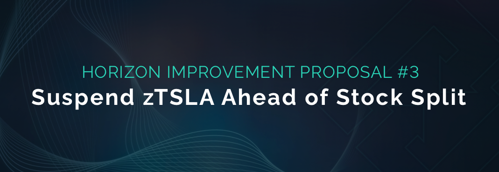

# HIP-3: Suspend zTSLA ahead of Stock Split

**Type:** Horizon Improvement Proposal\
**Date:** August 13th, 2022\
**Status:** Draft 1 | Completed

## Summary

Temporarily suspend trading of zTSLA ahead of the upcoming 3-for-1 stock split while the current zTSLA supply is 0 to avoid any user or global debt pool risks and resume trading zTSLA after the stock-adjusted price has traded on the traditional markets.

## Specification

* Suspend the trading and transfer of zTSLA in the protocol via the suspendSynth function
* Resume trading and transfers of zTSLA in the protocol via the resumeSynth function on August 25th, 2022

## Motivation

Tesla has [announced](https://www.sec.gov/Archives/edgar/data/1318605/000156459022028207/tsla-ex991\_6.htm) a 3-for-1 stock split and the trading with the new stock-split adjusted price will begin on August 25th EDT. The stock split adjusted price will be significantly lower than the pre-adjusted price and will have a direct impact on any user who holds the zTSLA zAsset on Horizon Protocol since oracles currently do not have the information or functions to allow for automated stock splits of the zAssets.

Users who hold zTSLA through the stock split will be at risk of having the value of their zTSLA holdings be significantly devalued, which could limit their ability to manage their C-Ratio since the value of their zAsset holdings will be reduced.

Currently there are no zTSLA holders, so by suspending zTSLA in the protocol it will eliminate any potential risk for users to be exposed to the stock split price change and also eliminate the need to take any further actions to protect against any potential impact to the global debt pool.

## **Potential Risks**

The implementation of this HIP might come with some risks, including the following:

* May introduce inconvenience for some users who wish to trade zTSLA before August 25th

## Considerations

Additional thoughts we should take into consideration:

* In a future HIP, we will need to further explore and create rules around how to handle future stock splits to minimize disruption and set up a system to mitigate potential risks.

## Feedback & Questions

If you have any questions or concerns, please do not hesitate to reach out.
