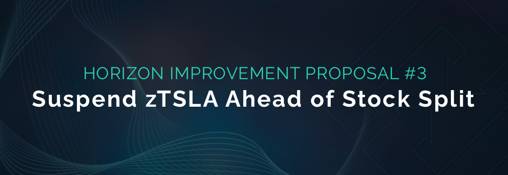

# HIP-4: Use Keepers to Close Weekly Fee Periods

**Type:** Horizon Improvement Proposal\
**Date:** August 30th, 2022\
**Status:** Draft 1

## Summary

Deploy a Keepers Upkeep contract and register a Keeper to automate the weekly fee period close.

## Specification

* Deploy a Keeper-compatible contract that automates the weekly period close to the BNB Chain mainnet
* Register and fund the Keeper

## Motivation

The closeCurrentFeePeriod() function in the FeePool contract is responsible for closing the current week’s collected fees and rewards and starting a new period each week (Claim Day). This function will also migrate any unclaimed rewards from the previous claimable period to the current claimable period, snapshot the fees/rewards for users for the new claimable period, and start a new period.

While the Horizon Protocol team actively maintains the closure of the fee period each week, this can also be done by anyone in the community, as the closeCurrentFeePeriod() is a public function that anyone can execute.&#x20;

The integration of Chainlink Keepers to automate this important protocol maintenance operation will help mitigate potential scenarios where the function isn’t called on time and help further decentralize the protocol.&#x20;

The Keepers upkeep will require ERC677 LINK tokens, which will be funded by the Community Fund. The Keeper Upkeep charges a [30% premium](https://docs.chain.link/docs/chainlink-keepers/supported-networks/) (which is low relative to other networks) to the gas fee required to call the function in order to fund the upkeep operation on their network. The closeCurrentFeePeriod() function uses \~220,000 gas (\~$0.30) on the BNB Chain mainnet, so the estimated cost of each transaction will be \~$0.40 paid in LINK tokens. Additionally, a [Minimum Balance](https://docs.chain.link/docs/chainlink-keepers/keeper-economics/#minimum-balance) must be maintained in the upkeep or it will cease to function. For this upkeep to function properly for the foreseeable future, and given that this upkeep is only used once per week, having an initial balance of \~XXX LINK should last XXX time.

## **Potential Risks**

The implementation of this HIP might come with some risks, including the following:

* A minimum balance of LINK tokens must be maintained in the Keeper or it will not perform the upkeep

## Considerations

Additional thoughts we should take into consideration:

* Should there be any failure in the Keeper network, the community should be aware that they can also call the closeCurrentFeePeriod() themselves to help maintain the protocol.

## Feedback & Questions

If you have any questions or concerns, please do not hesitate to reach out.
