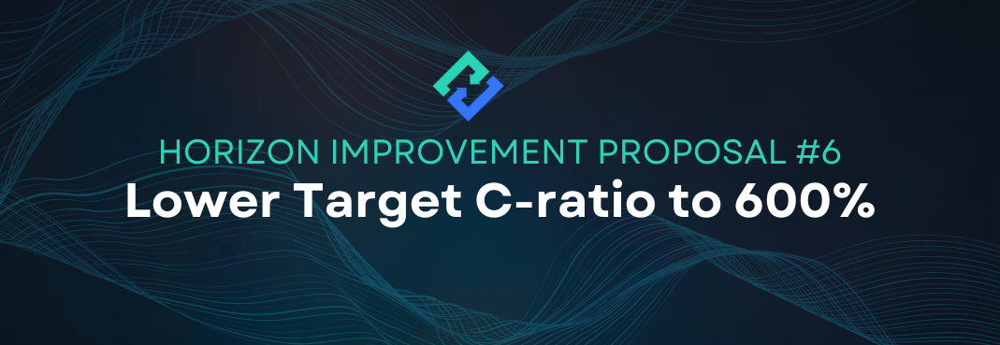

# HIP-6: Lower Target C-Ratio to 600% from 700%

**Type:** Horizon Improvement Proposal\
**Date:** Apr 19th, 2023 Status: Draft 1 \
**Status:** Draft 1

<figure><figcaption></figcaption></figure>

## Summary

Lower Target C-Ratio to 600% to increase zAsset liquidity.

This is the second HIP proposing a C-Ratio change. The first one was [HIP-2](hip-2-lower-target-c-ratio-to-700.md).

&#x20;

## Specification

* Set target C-Ratio to 600%

#### In Horizon Genesis, adjust Preset Strategies to:

* Conservative: 1100% → 1000%
* Neutral: 900% → 800%
* Aggressive: 700% → 600%

&#x20;

## Motivation

Lowering the Target C-Ratio to 600% will increase the total zAsset liquidity by about 17%. Lowering the C-Ratio incrementally will make changes less volatile and allow the community to see its impact on the system and on any open market liquidity pools (i.e. zUSD/BUSD LP on PancakeSwap).

Currently, there is about 443k TVL in the zUSD/BUSD LP and 247kTVL in the zBNB/BNB LP.  By increasing the supply of zAssets, more zUSD liquidity can be potentially supplied to the LP, making new users who want to just trade on Horizon Exchange, and not have to stake HZN, able to have access to a more liquid pool. Furthermore, more zAsset liquidity can potentially translate to greater trading volumes which generate more zUSD fees for HZN stakers to offset the lower Target C-Ratio. We expect an increase in zAsset demand as the roll out for Perpetual Futures trading and significant improvements to Horizon Exchange are made. A gradual ramp up for a more liquid stablecoin pool will make it easier for traders to enter the ecosystem and utilize its features as we continue to release new features and increase awareness for the project.

The zUSD/BUSD and zBNB/BNB staking pools on Horizon Genesis still offer very high APY for stablecoin yield farming. By increasing zAsset liquidity, more users can participate in these lower IL staking rewards to boost liquidity in the pool, otherwise a lowering of staking rewards for these pools might be merited to match the demand of stablecoin staking.&#x20;

&#x20;

## Potential Risks

The implementation of this HIP might come with some risks, including the following:

Increased liquidity of zUSD could potentially mean additional sell pressure for zUSD on the open market, which could put pressure on the $1.00 peg if the arbitrage demand is lacking.

For stakers, it is slightly easier to reach the 200% liquidation ratio, so stakers have to be slightly more vigilant in managing their debt. There is currently a long 3-day grace period to fix your wallet should you hit the liquidation ratio, so active stakers should have little issues with this adjustment.

## Considerations

Additional thoughts we should take into consideration:

For stakers who are not participating in trading, lowering the c-ratio generally presents no direct upside, though the additional zAsset liquidity could increase trading volumes on Horizon Exchange, leading to increased zUSD fee rewards. Furthermore it’s important to stress that More circulating zAssets will be productive towards the growth of the project.

&#x20;

## Feedback & Questions

**Q:** **If the C-ratio changes from 700% to 600% and everybody decides to now stake at 600% instead of 700%, how does the APY change? Is everybody more leveraged and incurring more risk, but for the same APY?**

A: In a sense, yes. By lowering from 700% to 600%, everyone is slightly closer to the 200% liquidation rate, hence, there is slightly more risk. But this is only if you choose to lower your C-Ratio to 600%. You can also maintain a higher C-Ratio by using the other strategies available, but you would not be getting the maximum possible return from staking. It is important to note that the goal of lowering the target ratio is to increase zAsset liquidity on the open market and increase trading volume in Horizon Exchange. The more liquidity, the more potential for users to trade zAssets and utilize Horizon Exchange. Lastly, the greater liquidity and utilization of zAssets, the more fees are generated in the protocol which are directly awarded to HZN stakers.&#x20;
