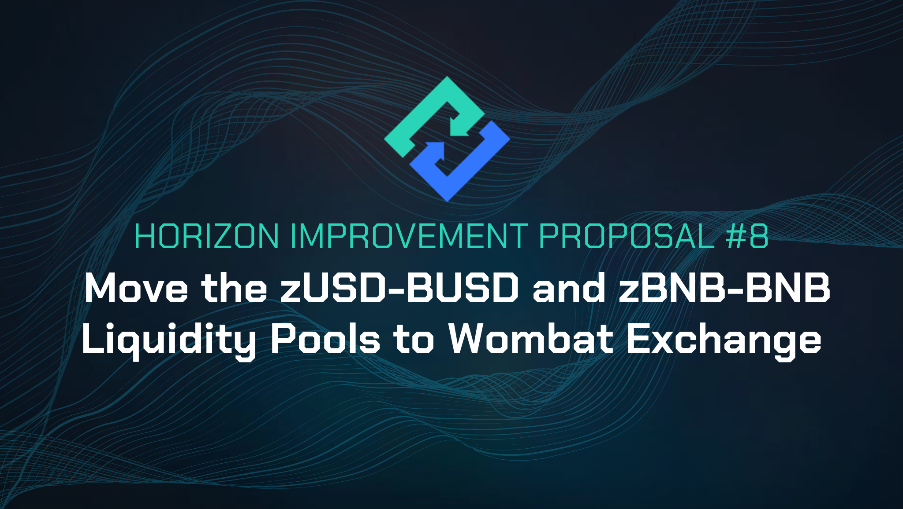

# HIP-8: Move the zUSD-BUSD and zBNB-BNB Liquidity Pools to Wombat Exchange

**Type:** Horizon Improvement Proposal \
**Date:** Aug 29th, 2023\
**Status:** Draft 2

<figure><figcaption></figcaption></figure>

## Summary

Migrate the incentive program for the [zUSD-BUSD liquidity pool](https://pancakeswap.finance/v2/add/0xe9e7CEA3DedcA5984780Bafc599bD69ADd087D56/0xF0186490B18CB74619816CfC7FeB51cdbe4ae7b9) on PancakeSwap v2 and the [zBNB-BNB liquidity pool ](https://ellipsis.finance/pool/0x51d5B7A71F807C950A45dD8b1400E83826Fc49F3)to new pools on [Wombat Exchange](https://www.wombat.exchange/). Introduce USDC stablecoin option for the zUSD liquidity pool as an alternative to the sunsetting BUSD stablecoin.

## Specification

* &#x20;Sunset the current incentive program on [Earn](https://genesis.horizonprotocol.com/earn) for the zUSD-BUSD liquidity pool on PancakeSwap v2
* Create a new incentive program for a zUSD-USDC liquidity pool on Wombat Exchange
*   Create a new incentive program for a zBNB-BNB liquidity pool on Wombat Exchange

    \

## Motivation

The main motivation is to simplify by consolidating our stablecoin liquidity pools into one stablecoin DEX and reducing the trading fees for each pair. Currently, the zUSD-BUSD liquidity pool on PancakeSwap V2 has a high 0.25% trading fee, which makes it expensive for arbitrage and trading.&#x20;

By migrating these pools to the same upcoming stablecoin DEX, the pegs should be easier to maintain with much lower fees, as only a 0.01% trading fee will be levied on trades. Wombat Exchange [will not require users to provide equal liquidity for both sides of the pair](https://medium.com/wombat-exchange/coverage-ratio-what-is-it-and-why-is-it-healthy-for-your-deposits-36663d18bb15) when providing liquidity, as it does on PancakeSwap V2, making it easier to participate (similar to the Curve model).

Wombat Exchange will also allow pairing zUSD with more than one stablecoin, opening up a door to sunset the usage of BUSD and use other stablecoins in its stead. USDC will be chosen as the alternative stablecoin, despite having lower liquidity than USDT, it is widely considered as a more trustworthy and transparent project.

Furthermore, token pairs on Wombat Exchange will be tradable through DEX aggregators such as [1INCH](https://coinmarketcap.com/alexandria/article/what-is-1inch-1inch), making our tokens more easily accessible in the broader DeFi ecosystem.&#x20;

The specifics of how the new incentive programs will be implemented will be proposed in HIP-9.

\

## Potential Risks

The implementation of this HIP might come with some risks, including the following:

* During the transition of liquidity to the new pools, there could be a period of limited liquidity for these pairs until the majority of the LPs migrate. HIP-7 will propose a way to mitigate this by using some of the [community funds](https://academy.horizonprotocol.com/horizon-protocol/introduction/tokenomics#horizon-protocol-supply-and-inflation-policy) to supply liquidity.
* Wombat is a newer exchange, relative to other DEXs, so it is not as time-tested.

## Considerations

Additional thoughts we should take into consideration:Additional thoughts we should take into consideration:

**Why not move to PancakeSwap v3?**

Although PancakeSwap v3 boasts lower fees, the recent switch to managing LP positions through NFT tokens has created challenges in incentivizing liquidity through our current weekly incentive program. Furthermore, participating in liquidity provision on PancakeSwap v3 demands more active engagement from users, who must actively manage the price range for their liquidity. To minimize unnecessary development, minimize risk, and ensure optimal results, we propose maintaining the current status quo of utilizing a BEP-20 based stablecoin DEX.

By leveraging Wombat Exchange as our BEP-20 based stablecoin DEX, we gain the ability to incentivize our liquidity as needed, while still enjoying the advantages of lower fees and simplified pegging. This approach streamlines the process, making it easier for our community to participate and contribute to the ecosystem.

**Why not Ellipsis Finance?**

Trading volume and liquidity have been migrating away from Ellipsis Finance and its integration into DEX aggregators is seemingly more limited. The recent exploit of the zBNB-BNB pool on Ellipsis Finance also has eroded market trust in the Vyper based stablecoin DEXs.

## Feedback & Questions

Please ask your questions here.

**Q: How does Wombat approach security?**

Wombat has undergone 5 audits by reputable auditors – Hacken, Peckshield, Zokyo, and Slowmist.&#x20;

They're also proactive in other ways:

\- They've teamed up with InsurAce for extra asset protection against vulnerabilities.

\- There's a Bounty program with Immunefi, offering significant rewards.

They're actively exploring additional security measures, collaborating with groups like code4rena.

**Q: What's Wombat's tech stack, and are they a fork?**

Wombat uses their own algorithm and design in Solidity – not a fork of any protocol.

**Q: How does Wombat handle updates and collaboration?**

If updates are made to the smart contract, Wombat will inform the community and partners about the update. Wombat will also conduct audits for any updates. To provide an additional layer of safety, a timelock mechanism is in place.

\

**Q: What's Wombat's plan in case of an exploit?**

Firstly, Wombat has implemented a time lock mechanism in their smart contract, requiring a 24-hour waiting period after initiating a transaction. This provides time for the team to respond effectively.&#x20;

The possible exploit procedures are such that Wombat would (i) immediately inform the community and their involved partner of the situation, (ii) work with Wombat’s whitehacker friends, CTO, and audit alliance to try to mitigate loss, (iii) ensure the loss/hack situation is cleared before moving onto compensation, (iv) try their best to get compensation for those directly affected by the hack from whoever should be responsible for the hack.

\
\
